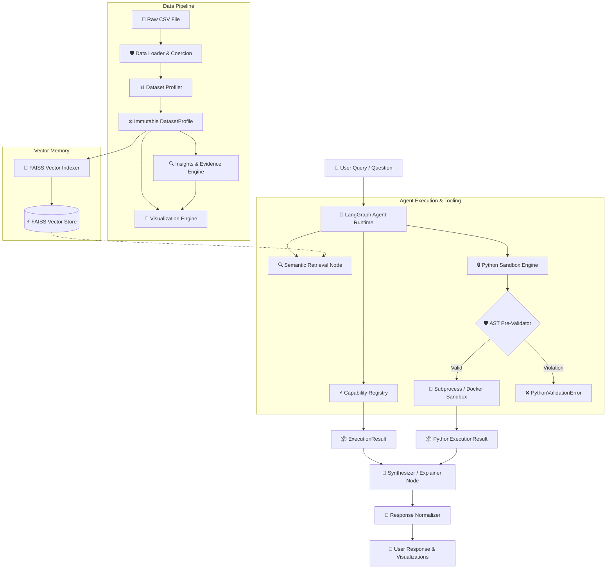

<div align="center">

# 📊 CSV Analytics Agent

**An Enterprise-Grade, Deterministic & Agentic Tabular Data Analytics Engine built with Python 3.10+, Pydantic v2, LangGraph, FAISS Vector Memory, and Multi-Backend Secure Execution Sandboxes.**

[](https://www.python.org/)
[](https://github.com/Vishaldave45/CSV-Analytics-Agent/releases)
[](https://github.com/Vishaldave45/CSV-Analytics-Agent)
[](https://github.com/astral-sh/ruff)
[](https://github.com/python/mypy)
[](LICENSE)

</div>

---

## 🌟 Overview

The **CSV Analytics Agent** is an end-to-end, evidence-backed tabular data intelligence platform. It converts raw `.csv` datasets into empirical statistical profiles, proactive business insights, renderer-independent visualization specifications, vector-indexed semantic memory, and safe dynamic analytical executions.

Built upon **Domain-Driven Design (DDD)** and **Clean Architecture** principles, the platform enforces a strict operational principle:

> [!IMPORTANT]
> **Deterministic First, LLM Second**: Statistical computations, data profiling, proactive rule evaluations, chart recommendations, and capability execution engines are evaluated **deterministically** using pure Python, Pandas, and immutable Pydantic v2 domain models. The LLM (Gemini via LangChain/LangGraph) operates purely as an orchestrator and narrative synthesizer. This architecture completely eliminates statistical hallucinations and guarantees 100% explainable, reproducible analytical outcomes.

---

## ✨ System Features & Capabilities

| Capability | Module / Layer | Description |
| :--- | :--- | :--- |
| 🛡️ **Robust Ingestion & Coercion** | `preprocessing/` | Auto-detects encodings (`utf-8`, `latin-1`, `cp1252`, `iso-8859-1`), validates structural integrity, coercively parses numeric/date types, and generates SHA256 dataset hashes. |
| 📊 **Column Statistical DNA** | `profiler/` | Computes pure summary statistics (row/col count, missingness ratios, exact row duplicates, cardinality, memory distribution, min/max/mean/std, quantiles) without side effects. |
| 🔍 **Proactive Evidence Engine** | `insights/` | Pure business rules evaluate immutable dataset profiles to synthesize ranked findings (`Insight`) paired with empirical data facts (`Evidence`). |
| 🎨 **Visualization Engine** | `visualization/` | Rule-based recommender maps statistical metadata to renderer-independent chart specifications (`HISTOGRAM`, `BAR`, `LINE`, `SCATTER`, `BOXPLOT`, `PIE`, `HEATMAP`) and renders high-res Matplotlib PNGs or Plotly charts. |
| ⚡ **Capability Execution Framework** | `execution/` | Decouples domain capabilities (`AnalyticsEngine`, `VisualizationEngine`) from underlying providers (`PandasProvider`) registered inside a centralized `CapabilityRegistry`. |
| 🧠 **Semantic Vector Memory** | `memory/` | Index dataset column schemas and metadata into a local FAISS vector store (`SentenceTransformers`) for semantic column retrieval during agentic planning. |
| 🛡️ **Multi-Layer Python Sandbox** | `python_engine/` | Executes dynamic, LLM-generated Python analysis code within an isolated subprocess (`SubprocessBackend`) or hardened unprivileged Docker container (`DockerBackend`) guarded by AST static analysis. |
| 🔄 **LangGraph Stateful Runtime** | `graph/` | StateGraph workflow featuring in-memory state checkpointing, plan-execute loops, memory retrieval nodes, and conversational state persistence. |
| 🔄 **Response Normalizer** | `services/` | Traverses content blocks and Python single-quote repr strings (`ast.literal_eval`), extracting clean Markdown text into `AgentResponse` while discarding internal metadata (`extras`, `signature`). |
| 🖥️ **Streamlit Web Dashboard** | `streamlit_app/` | Multi-page Streamlit application providing interactive dataset exploration, Bento-style statistical cards, insights tables, chart rendering, settings, and AI chat workspace. |

---

## 🏗️ Architecture & Pipeline Flow

The platform separates data ingestion, statistical profiling, memory indexing, graph orchestration, response normalization, and sandboxed code execution into distinct, modular layers:



---

## 🔄 Response Normalization & UI Pipeline

When modern LLMs (such as Google Gemini via `langchain-google-genai`) produce response content blocks, the raw string representation contains internal metadata dictionaries (`extras`, `signature`, `tool_call_id`).

To guarantee clean, human-readable UI rendering:

1. **`_clean_text_content`** recursively inspects raw block lists or string representations.
2. Uses `json.loads` and `ast.literal_eval` to safely parse single-quoted Python repr strings.
3. Filters strictly for `"type": "text"` payloads, stripping away internal signatures and metadata.
4. Returns a clean, strong `AgentResponse` contract consumed by Streamlit's `st.markdown()` renderer.

---

## 🔒 Security Architecture & Python Sandboxing

The **CSV Analytics Agent** features a dedicated multi-layer execution domain (`python_engine`) engineered to execute dynamically generated Python code securely.

```text
       Generated Python Source Code
                    │
                    ▼
  ┌───────────────────────────────────┐
  │ Layer 1: AST Pre-Execution Check  │  <-- Inspects imports, attributes, builtins
  └─────────────────┬─────────────────┘
                    │ Valid
                    ▼
  ┌───────────────────────────────────┐
  │ Layer 2: Environment Stripping   │  <-- Removes GOOGLE_API_KEY, secrets, etc.
  └─────────────────┬─────────────────┘
                    │
                    ▼
  ┌───────────────────────────────────┐
  │ Layer 3: Execution Isolation      │
  │   - SubprocessBackend (Local)     │  <-- Isolated temp directory + timeout caps
  │   - DockerBackend (Container)     │  <-- Unprivileged, read-only root, no net
  └───────────────────────────────────┘
```

### Defense-in-Depth Security Controls

1. **AST Static Code Analysis (`validate_python_code`)**:
   - Inspects AST nodes prior to execution without running code.
   - Rejects unapproved or high-risk imports (`os`, `sys`, `subprocess`, `socket`, `pathlib`, `shutil`, `ctypes`, `importlib`, etc.).
   - Rejects dangerous builtins (`exec`, `eval`, `compile`, `__import__`, `open`, `input`, `breakpoint`).
   - Blocks dangerous attribute introspection (`__subclasses__`, `__globals__`, `__code__`, `__closure__`, `__builtins__`).
2. **Subprocess Backend (`SubprocessBackend`)**:
   - Executes validated code in a clean, isolated temporary workspace (`py_sandbox_*`).
   - Purges parent process secrets and API keys (`GOOGLE_API_KEY`, etc.) from environment variables.
   - Enforces execution timeouts and stdout/stderr byte caps.
3. **Docker Container Backend (`DockerBackend`)**:
   - Executes code inside an unprivileged Docker container (`--user 1000:1000`).
   - Disables network access by default (`--network none`).
   - Mounts read-only root filesystem (`--read-only`) with isolated temporary workspace (`/workspace`).
   - Drops Linux capabilities (`--cap-drop=ALL`, `--security-opt no-new-privileges:true`).
   - Restricts system resources (`--memory 512m`, `--cpus 1.0`, `--pids-limit 64`).

---

## ⚡ Quickstart & Installation

### 1. Prerequisites
- **Python**: 3.10 or higher
- **Package Manager**: [`uv`](https://github.com/astral-sh/uv) (recommended) or `pip`
- **Docker** (optional, required only for containerized sandbox execution)

### 2. Clone & Install Dependencies

```bash
# Clone the repository
git clone https://github.com/Vishaldave45/CSV-Analytics-Agent.git
cd CSV-Analytics-Agent

# Install dependencies using uv (creates .venv automatically)
uv sync

# Or using standard pip
pip install -e ".[dev]"
```

### 3. Environment Configuration

Copy the example environment file and configure optional keys:

```bash
cp .env.example .env
```

Edit `.env`:
```ini
# Application & Gemini LLM Settings
GOOGLE_API_KEY=AIzaSy_your_key_here

# Python Execution Engine Sandbox Configuration
PYTHON_EXECUTION_BACKEND=subprocess  # Options: 'subprocess' or 'container'
PYTHON_SANDBOX_IMAGE=csv-analytics-python:latest
PYTHON_SANDBOX_MEMORY_MB=512
PYTHON_SANDBOX_CPU_LIMIT=1.0
PYTHON_SANDBOX_PIDS_LIMIT=64
PYTHON_SANDBOX_TIMEOUT_SECONDS=30
PYTHON_SANDBOX_NETWORK=false

# LangSmith Tracing (Optional)
LANGCHAIN_TRACING_V2=false
LANGCHAIN_API_KEY=your_langsmith_key_here
```

### 4. Build Docker Sandbox Image (Optional)

If using containerized Python execution (`PYTHON_EXECUTION_BACKEND=container`), build the sandbox image:

```bash
docker build -t csv-analytics-python:latest ./sandbox
```

### 5. Launch the Streamlit Web Dashboard

```bash
uv run streamlit run streamlit_app/app.py
```

Open your browser at `http://localhost:8501`.

---

## 🛠️ Repository & Project Directory Structure

```text
csv-analytics-agent/
├── src/csv_analytics_agent/
│   ├── config/             # Pydantic Settings & environment config management
│   ├── exceptions/         # System-wide base exception hierarchy
│   ├── llm/                # LangChain LLM abstraction & Gemini API integration
│   ├── preprocessing/      # Data loading, encoding detection & coercion
│   ├── profiler/           # Column statistics & dataset profiling
│   ├── insights/           # Proactive evidence & business rules engine
│   ├── visualization/      # Chart recommendation & Matplotlib/Plotly renderers
│   ├── execution/          # CapabilityRegistry, AnalyticsEngine, PandasProvider
│   ├── persistence/        # SQLite metadata storage & SHA256 hashing
│   ├── memory/             # FAISS vector store & column semantic search
│   ├── observability/      # LangSmith callback handlers & tracing setup
│   ├── services/           # Result normalizer & API boundary converters
│   ├── graph/              # LangGraph StateGraph & AgentRuntime engine
│   └── python_engine/      # AST pre-validator, subprocess & Docker sandbox
├── streamlit_app/          # Streamlit Multi-Page Web Application
│   ├── app.py              # Application entrypoint
│   ├── components/         # Reusable Streamlit UI components
│   ├── pages/              # Overview, Dataset, Insights, Chat, Settings
│   └── services/           # Backend gateway service bridge
├── sandbox/                # Docker sandbox container build context
├── docs/                   # System architecture & normalization docs
├── tests/                  # Complete unit and result normalization test suite
├── .env.example            # Environment variable template
├── pyproject.toml          # Project configuration & dependencies (uv / hatchling)
└── README.md               # Master GitHub technical documentation
```

---

## 🧪 Quality Assurance & Test Verification

```bash
# 1. Run Ruff Linter
uv run ruff check .

# 2. Run MyPy Static Type Checker (Strict Mode)
uv run mypy src

# 3. Run Unit Test Suite
uv run pytest tests/results/ -v
```

---

## 📄 License

This project is licensed under the **MIT License**. See the [LICENSE](LICENSE) file for details.