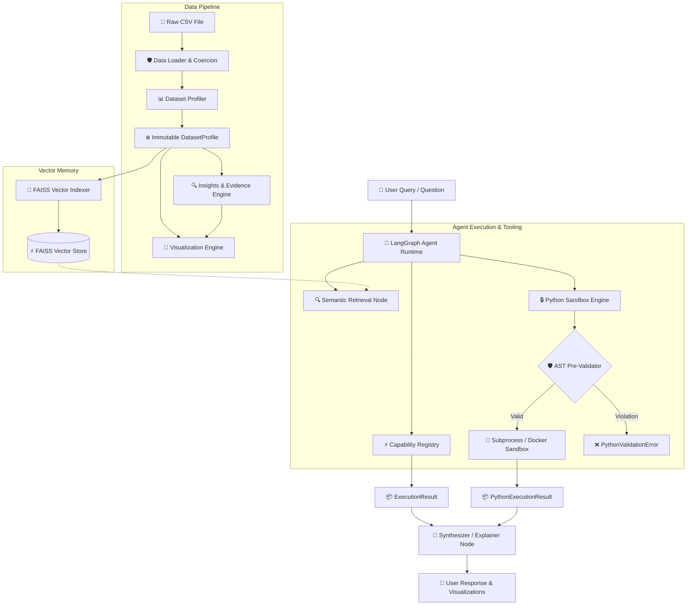

<div align="center">

# 📊 CSV Analytics Agent

**An Enterprise-Grade, Deterministic & Agentic Tabular Data Analytics Engine built with Python 3.10+, Pydantic v2, LangGraph, FAISS Vector Memory, and Multi-Backend Secure Execution Sandboxes.**

[](https://www.python.org/)
[](https://github.com/Vishaldave45/CSV-Analytics-Agent/releases)
[](https://github.com/Vishaldave45/CSV-Analytics-Agent)
[](https://github.com/Vishaldave45/CSV-Analytics-Agent)
[](https://github.com/astral-sh/ruff)
[](https://github.com/python/mypy)
[](LICENSE)

</div>

---

## 🌟 Overview

The **CSV Analytics Agent** is an end-to-end, evidence-backed tabular data intelligence platform. It converts raw `.csv` datasets into empirical statistical profiles, proactive business insights, renderer-independent visualization specifications, vector-indexed semantic memory, and safe dynamic analytical executions.

Built upon **Domain-Driven Design (DDD)** and **Clean Architecture** principles, the platform enforces a strict operational principle:

> [!IMPORTANT]
> **Deterministic First, LLM Second**: Statistical computations, data profiling, proactive rule evaluations, chart recommendations, and capability execution engines are evaluated **deterministically** using pure Python, Pandas, and immutable Pydantic v2 domain models. The LLM (Gemini via LangChain/LangGraph) operates purely as an orchestrator and narrative synthesizer. This architecture completely eliminates statistical hallucinations and guarantees 100% explainable, reproducible analytical outcomes.

---

## ✨ System Features & Capabilities

| Capability | Module / Layer | Description |
| :--- | :--- | :--- |
| 🛡️ **Robust Ingestion & Coercion** | `preprocessing/` | Auto-detects encodings (`utf-8`, `latin-1`, `cp1252`, `iso-8859-1`), validates structural integrity, coercively parses numeric/date types, and generates MD5/SHA256 dataset hashes. |
| 📊 **Column Statistical DNA** | `profiler/` | Computes pure summary statistics (row/col count, missingness ratios, exact row duplicates, cardinality, memory distribution, min/max/mean/std, quantiles) without side effects. |
| 🔍 **Proactive Evidence Engine** | `insights/` | Pure business rules evaluate immutable dataset profiles to synthesize ranked findings (`Insight`) paired with empirical data facts (`Evidence`). |
| 🎨 **Visualization Engine** | `visualization/` | Rule-based recommender maps statistical metadata to renderer-independent chart specifications (`HISTOGRAM`, `BAR`, `LINE`, `SCATTER`, `BOXPLOT`, `PIE`, `HEATMAP`) and renders high-res Matplotlib PNGs. |
| ⚡ **Capability Execution Framework** | `execution/` | Decouples domain capabilities (`AnalyticsEngine`, `VisualizationEngine`) from underlying providers (`PandasProvider`) registered inside a centralized `CapabilityRegistry`. |
| 🧠 **Semantic Vector Memory** | `memory/` | Index dataset column schemas and metadata into a local FAISS vector store (`SentenceTransformers`) for semantic column retrieval during agentic planning. |
| 🛡️ **Multi-Layer Python Sandbox** | `python_engine/` | Executes dynamic, LLM-generated Python analysis code within an isolated subprocess (`SubprocessBackend`) or hardened unprivileged Docker container (`DockerBackend`) guarded by AST static analysis. |
| 🔄 **LangGraph Stateful Runtime** | `graph/` | StateGraph workflow featuring `SqliteSaver` thread checkpointing, plan-execute loops, memory retrieval nodes, and conversational state persistence. |
| 📡 **LangSmith Telemetry & Tracing** | `observability/` | Native callback instrumentation (`AgentTracingCallbackHandler`) for tracking latency, token metrics, tool invocations, and thread metadata. |
| 🖥️ **Streamlit Web Dashboard** | `streamlit_app/` | Multi-page Streamlit application providing interactive dataset exploration, Bento-style statistical cards, insights tables, chart rendering, settings, and AI chat interface. |

---

## 🏗️ Architecture & Pipeline Flow

The platform separates data ingestion, statistical profiling, memory indexing, graph orchestration, and sandboxed code execution into distinct, modular layers:



---

## 🔒 Security Architecture & Python Sandboxing

The **CSV Analytics Agent** features a dedicated multi-layer execution domain (`python_engine`) engineered to execute dynamically generated Python code securely.

> [!WARNING]
> **Security Limitation Note**: Subprocess and container isolation provide a local development and container execution boundary, but are not equivalent to a formally verified microVM sandbox (e.g., gVisor or Firecracker).

```text
       Generated Python Source Code
                    │
                    ▼
  ┌───────────────────────────────────┐
  │ Layer 1: AST Pre-Execution Check  │  <-- Inspects imports, attributes, builtins
  └─────────────────┬─────────────────┘
                    │ Valid
                    ▼
  ┌───────────────────────────────────┐
  │ Layer 2: Environment Stripping   │  <-- Removes GOOGLE_API_KEY, secrets, etc.
  └─────────────────┬─────────────────┘
                    │
                    ▼
  ┌───────────────────────────────────┐
  │ Layer 3: Execution Isolation      │
  │   - SubprocessBackend (Local)     │  <-- Isolated temp directory + timeout caps
  │   - DockerBackend (Container)     │  <-- Unprivileged, read-only root, no net
  └───────────────────────────────────┘
```

### Defense-in-Depth Security Controls

1. **AST Static Code Analysis (`validate_python_code`)**:
   - Inspects AST nodes prior to execution without running code.
   - Rejects unapproved or high-risk imports (`os`, `sys`, `subprocess`, `socket`, `pathlib`, `shutil`, `ctypes`, `importlib`, etc.).
   - Rejects dangerous builtins (`exec`, `eval`, `compile`, `__import__`, `open`, `input`, `breakpoint`).
   - Blocks dangerous attribute introspection (`__subclasses__`, `__globals__`, `__code__`, `__closure__`, `__builtins__`).
2. **Subprocess Backend (`SubprocessBackend`)**:
   - Executes validated code in a clean, isolated temporary workspace (`py_sandbox_*`).
   - Purges parent process secrets and API keys (`GOOGLE_API_KEY`, etc.) from environment variables.
   - Enforces execution timeouts and stdout/stderr byte caps.
3. **Docker Container Backend (`DockerBackend`)**:
   - Executes code inside an unprivileged Docker container (`--user 1000:1000`).
   - Disables network access by default (`--network none`).
   - Mounts read-only root filesystem (`--read-only`) with isolated temporary workspace (`/workspace`).
   - Drops Linux capabilities (`--cap-drop=ALL`, `--security-opt no-new-privileges:true`).
   - Restricts system resources (`--memory 512m`, `--cpus 1.0`, `--pids-limit 64`).

---

## ⚡ Quickstart & Installation

### 1. Prerequisites
- **Python**: 3.10 or higher
- **Package Manager**: [`uv`](https://github.com/astral-sh/uv) (recommended) or `pip`
- **Docker** (optional, required only for containerized sandbox execution)

### 2. Clone & Install Dependencies

```bash
# Clone the repository
git clone https://github.com/Vishaldave45/CSV-Analytics-Agent.git
cd CSV-Analytics-Agent

# Install dependencies using uv (creates .venv automatically)
uv sync

# Or using standard pip
pip install -e ".[dev]"
```

### 3. Environment Configuration

Copy the example environment file and configure optional keys:

```bash
cp .env.example .env
```

Edit `.env`:
```ini
# Application & Gemini LLM Settings
GOOGLE_API_KEY=AIzaSy_your_key_here

# Python Execution Engine Sandbox Configuration
PYTHON_EXECUTION_BACKEND=subprocess  # Options: 'subprocess' or 'container'
PYTHON_SANDBOX_IMAGE=csv-analytics-python:latest
PYTHON_SANDBOX_MEMORY_MB=512
PYTHON_SANDBOX_CPU_LIMIT=1.0
PYTHON_SANDBOX_PIDS_LIMIT=64
PYTHON_SANDBOX_TIMEOUT_SECONDS=30
PYTHON_SANDBOX_NETWORK=false

# LangSmith Tracing (Optional)
LANGCHAIN_TRACING_V2=false
LANGCHAIN_API_KEY=your_langsmith_key_here
```

### 4. Build Docker Sandbox Image (Optional)

If using containerized Python execution (`PYTHON_EXECUTION_BACKEND=container`), build the sandbox image:

```bash
docker build -t csv-analytics-python:latest ./sandbox
```

### 5. Launch the Streamlit Web Dashboard

```bash
uv run streamlit run streamlit_app/app.py
```

Open your browser at `http://localhost:8501`.

---

## 💻 Programmatic Python API Usage

### 1. Data Ingestion & Statistical Profiling

```python
import pandas as pd
from csv_analytics_agent.preprocessing import load_and_coerce_csv
from csv_analytics_agent.profiler import DatasetProfiler

# Load CSV with automatic encoding detection and coercion
df, profile, content_hash = load_and_coerce_csv("data/sales_data.csv")

print(f"Dataset Loaded: {profile.summary.row_count} rows x {profile.summary.column_count} columns")
print(f"Dataset Hash: {content_hash}")
```

### 2. Proactive Insights & Visualization Recommendation

```python
from csv_analytics_agent.insights import InsightsGenerator
from csv_analytics_agent.visualization import recommend_visualizations, render_chart_to_bytes

# Generate proactive empirical insights
insights = InsightsGenerator().generate(profile)
for insight in insights:
    print(f"[{insight.severity.value.upper()}] {insight.title}: {insight.description}")

# Generate chart specifications & render PNG image bytes
charts = recommend_visualizations(profile, insights=insights)
if charts:
    img_bytes = render_chart_to_bytes(charts[0], df)
    with open("chart.png", "wb") as f:
        f.write(img_bytes)
```

### 3. Secure Python Sandbox Execution

```python
from csv_analytics_agent.python_engine import (
    PythonExecutionRequest,
    create_python_executor,
)

# Instantiate executor via factory (subprocess or container)
executor = create_python_executor(mode="subprocess")

# Define analytical code request
request = PythonExecutionRequest(
    code="""
import math
total_revenue = df['revenue'].sum()
avg_quantity = df['quantity'].mean()
result_summary = f"Revenue: ${total_revenue:,.2f}, Avg Qty: {avg_quantity:.1f}"
""",
    question="Calculate revenue and average quantity",
)

# Execute code safely against target DataFrame
result = executor.execute(request, df)

print(f"Success: {result.success}")
print(f"Captured stdout: {result.stdout}")
for artifact in result.artifacts:
    print(f"Artifact [{artifact.artifact_type.value}]: {artifact.name} = {artifact.data}")
```

### 4. LangGraph Agent Runtime Execution

```python
from csv_analytics_agent.graph.runtime import AgentRuntime

# Initialize stateful AgentRuntime with registered capabilities and memory
runtime = AgentRuntime.create_default(df=df, dataset_name="sales_data.csv")

# Execute natural-language query through LangGraph workflow
response_state = runtime.invoke("What is the average revenue per product category?")

# Access generated agent response
messages = response_state.get("messages", [])
print("Agent Response:", messages[-1].content if messages else "No response")
```

---

## 🛠️ Repository & Project Directory Structure

```text
csv-analytics-agent/
├── src/csv_analytics_agent/
│   ├── config/             # Pydantic Settings & environment config management
│   ├── exceptions/         # System-wide base exception hierarchy
│   ├── llm/                # LangChain LLM abstraction & Gemini API integration
│   ├── preprocessing/      # Stage 1: File loading, encoding detection & coercion
│   ├── profiler/           # Stage 2: Pure dataset statistics & column profiling
│   ├── insights/           # Stage 3: Proactive evidence & business rules engine
│   ├── visualization/      # Stage 4: Renderer-agnostic chart spec & Matplotlib renderer
│   ├── execution/          # Stage 5: CapabilityRegistry, AnalyticsEngine, PandasProvider
│   ├── persistence/        # Stage 7.1: SQLite metadata storage & SHA256 hashing
│   ├── memory/             # Stage 7.5: FAISS vector store & column semantic search
│   ├── observability/      # Stage 7.8: LangSmith callback handlers & tracing setup
│   ├── graph/              # Stage 7.9: LangGraph StateGraph, SqliteSaver, AgentRuntime
│   └── python_engine/      # Stage 8.1–8.3: Secure Python execution sandbox domain
│       ├── models.py       # Immutable Pydantic v2 request/result/artifact domain models
│       ├── base.py         # BasePythonExecutor abstract base class
│       ├── errors.py       # Python engine domain exception hierarchy
│       ├── policy.py       # PythonSandboxPolicy & AST static code validator
│       ├── backends.py     # SubprocessBackend & unprivileged DockerBackend
│       └── sandbox.py      # PythonSandboxExecutor, DockerPythonExecutor & factory
├── streamlit_app/          # Streamlit Multi-Page Web Application
│   ├── app.py              # Application entrypoint
│   ├── config.py           # Presentation UI configuration
│   ├── theme.py            # Custom CSS dark glassmorphism design system
│   ├── components/         # Reusable Streamlit UI components (header, footer, cards, sidebar)
│   ├── pages/              # Streamlit pages (Overview, Dataset, Insights, Chat, Settings, etc.)
│   └── services/           # Gateway backend bridge & session state services
├── sandbox/                # Docker sandbox container build context
│   ├── Dockerfile          # Unprivileged non-root Python 3.10 sandbox image build file
│   └── requirements.txt    # Sandbox dependencies (pandas, numpy, scipy, matplotlib, plotly)
├── tests/                  # Complete unit test suite (267 passing tests)
│   ├── config/
│   ├── graph/
│   ├── llm/
│   ├── memory/
│   ├── observability/
│   ├── persistence/
│   ├── python_engine/      # Unit, security, backend, factory & Docker integration tests
│   ├── streamlit_app/
│   └── visualization/
├── .env.example            # Environment variable template
├── pyproject.toml          # Project configuration & dependencies (uv / hatchling)
├── ruff.toml              # Ruff linter & formatter configuration
├── mypy.ini                # Strict MyPy static type checker configuration
└── README.md               # Root technical documentation
```

---

## 🧪 Quality Assurance & Test Verification

The codebase maintains strict quality controls, 100% type annotations, zero linter warnings, and comprehensive test coverage:

```bash
# 1. Run Ruff Linter
uv run ruff check .

# 2. Run Ruff Formatting Check
uv run ruff format --check .

# 3. Run MyPy Static Type Checker (Strict Mode)
uv run mypy src

# 4. Run Unit Test Suite (excluding live LLM and Docker tests)
uv run pytest -m "not llm and not docker"

# 5. Run Unit Test Suite with Statement Coverage
uv run pytest --cov=csv_analytics_agent --cov-report=term-missing -m "not llm and not docker"

# 6. Run Docker Integration Tests (requires Docker daemon)
uv run pytest -m docker
```

### Current Quality Metrics

| Check | Tool | Result |
| :--- | :--- | :--- |
| **Linting** | Ruff v0.9+ | **0 Errors** across all files |
| **Formatting** | Ruff Formatter | **196 Files Formatted** |
| **Type Checking** | MyPy Strict | **0 Errors** across 82 source files |
| **Unit Tests** | Pytest | **267 Passed** (0 failures) |
| **Test Coverage** | Pytest-Cov | **89% Total Coverage** |

---

## 🗺️ Product Roadmap & Stage Progress

- [x] **Stage 1 — Ingestion & Coercion** (`v0.1.0`): Auto-encoding detection, file validation, structural checks.
- [x] **Stage 2 — Dataset Profiler** (`v0.2.0`): Column statistical DNA, missingness, duplicates, memory summary.
- [x] **Stage 3 — Insights Engine** (`v0.3.0`): Empirical business rule evaluation, structured findings, evidence synthesis.
- [x] **Stage 4 — Visualization Engine** (`v0.4.0`): Chart recommendation rules, spec generation, Matplotlib rendering.
- [x] **Stage 5 — Execution Framework** (`v0.5.0`): `CapabilityRegistry`, `AnalyticsEngine`, `VisualizationEngine`, `PandasProvider`.
- [x] **Stage 6 — Deterministic Planner** (`v0.6.0`): `RulePlanner`, `QueryParser`, confidence scoring, trace logs.
- [x] **Stage 7.1–7.10 — Agentic System** (`v0.7.0`): `SqliteSaver`, FAISS Vector Memory, LangSmith Observability, LangGraph `AgentRuntime`, Streamlit UI.
- [x] **Stage 8.1 — Python Engine Interface** (`v0.8.1`): Domain models (`PythonExecutionRequest`, `PythonExecutionResult`, `PythonArtifact`), exception hierarchy, `BasePythonExecutor`.
- [x] **Stage 8.2 — Subprocess Sandbox** (`v0.8.2`): `PythonSandboxPolicy`, AST pre-validation, `SubprocessBackend`, isolated execution boundary.
- [x] **Stage 8.3 — Production-Hardened Sandbox** (`v0.8.3`): `BaseSandboxBackend`, `DockerBackend`, unprivileged read-only Docker sandbox, resource caps, `create_python_executor` factory.
- [ ] **Stage 8.4 — Agentic Code Generation Tool**: LangChain tool adapter connecting dynamic Python sandbox execution to LangGraph planner.

---

## 📄 License

This project is licensed under the **MIT License**. See the [LICENSE](LICENSE) file for details.