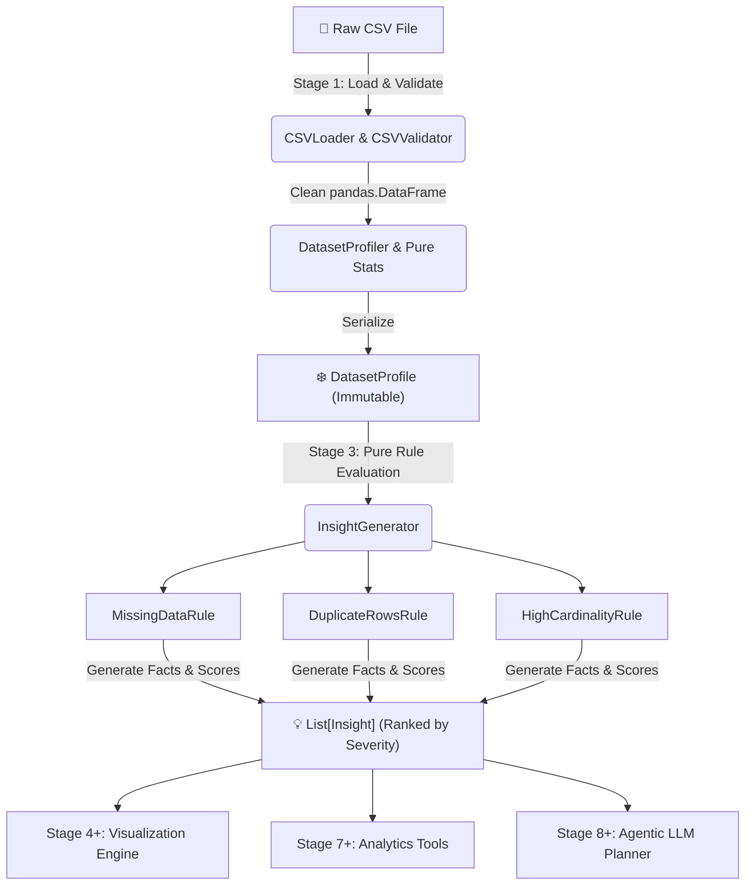

<div align="center">

# 📊 CSV Analytics Agent

**A production-grade, evidence-driven tabular analytics framework built with Python 3.10+, Pydantic v2, and a deterministic layered pipeline architecture.**

[](https://www.python.org/)
[](https://github.com/Vishaldave45/CSV-Analytics-Agent)
[](https://github.com/Vishaldave45/CSV-Analytics-Agent)
[](https://github.com/astral-sh/ruff)
[](https://github.com/python/mypy)
[](LICENSE)
[](docs/adr/ADR-001-project-architecture.md)

</div>

---

## 🌟 Overview

The **CSV Analytics Agent** converts raw tabular data (`.csv` files) into structured, evidence-backed insights. Designed around **Domain-Driven Design (DDD)** principles, the agent processes datasets through a strict, multi-stage pipeline where statistics and business rules are calculated deterministically before being passed to downstream visualization engines, tools, or agentic LLMs.

> [!IMPORTANT]
> **Deterministic First, LLM Second**: Statistics and business metrics are evaluated using pure, mathematical rule evaluators operating on frozen metadata. This eliminates hallucinated data summaries and guarantees 100% explainability.

---

## ✨ Key Capabilities

| Feature | Description |
| :--- | :--- |
| 🛡️ **Robust Data Loader** | Validates structural integrity, missing files, non-empty bounds, and automatically detects encodings (`utf-8`, `latin-1`, `cp1252`, `iso-8859-1`). |
| 📊 **Pure Dataset Profiler** | Computes missing value ratios, row duplicates, memory distribution, and column-level statistical profiles without side effects. |
| 🔍 **Evidence Engine** | Pure business rules evaluate immutable dataset profiles to generate structured findings (`Insight`) backed by empirical facts (`Evidence`). |
| ⚡ **Zero Rescan Pipeline** | Upstream profiles and insights freeze as Pydantic v2 models. Downstream stages consume metadata without re-reading Pandas DataFrames. |
| 🎯 **Severity Prioritization** | Automatically ranks findings by severity (`CRITICAL` → `HIGH` → `MEDIUM` → `LOW` → `INFO`) for actionable data diagnostics. |
| 🧪 **100% Test Coverage** | Every module, validation guard, statistical evaluator, and exception path is tested with full statement coverage. |

---

## 🏗️ Architecture & Pipeline Flow

The framework follows a decoupled 4-tier pipeline flow:



### Layer Responsibilities

```text
                           ┌────────────────────────┐
                           │      Raw CSV File      │
                           └───────────┬────────────┘
                                       │
                                       ▼
 ┌───────────────────────────────────────────────────────────────────────────┐
 │ Stage 1 — Data Ingestion & Validation Layer                               │
 │ (Handles encoding auto-detection, schema checks, structural balance)     │
 └─────────────────────────────┬─────────────────────────────────────────────┘
                               │
                               ▼
 ┌───────────────────────────────────────────────────────────────────────────┐
 │ Stage 2 — Dataset Profiling & Statistical Engine                          │
 │ (Row/Col summary, Missing values, Memory distribution, Column profiles)  │
 └─────────────────────────────┬─────────────────────────────────────────────┘
                               │
                               ▼
 ┌───────────────────────────────────────────────────────────────────────────┐
 │ Stage 3 — Insights Engine & Structured Evidence Generation                │
 │ (Evaluates missing, duplicates, cardinality; emits Insight & Evidence)    │
 └─────────────────────────────┬─────────────────────────────────────────────┘
                               │
            ┌──────────────────┼──────────────────┐
            ▼                  ▼                  ▼
   Visualization Engine  Analytics Tools     Agentic LLM Planner
```

---

## ⚡ Quickstart

### Installation

Clone the repository and set up your virtual environment using `uv` (recommended) or `pip`:

```bash
# Clone the repository
git clone https://github.com/Vishaldave45/CSV-Analytics-Agent.git
cd CSV-Analytics-Agent

# Sync dependencies with uv (creates .venv automatically)
uv sync

# Or using standard pip in editable mode
pip install -e ".[dev]"
```

### Python API Example

```python
from pathlib import Path
from csv_analytics_agent.data import CSVLoader
from csv_analytics_agent.profiler import DatasetProfiler
from csv_analytics_agent.insights import InsightGenerator

# 1. Load and validate CSV file safely
file_path = Path("data/sample_dataset.csv")
loader = CSVLoader(file_path=file_path)
df = loader.load()

# 2. Compute pure dataset profile & statistics
profiler = DatasetProfiler()
profile = profiler.profile(df)

print(f"Dataset Shape: {profile.summary.row_count} rows x {profile.summary.column_count} columns")
print(f"Total Missing Ratio: {profile.summary.missing_percentage:.2%}")

# 3. Generate evidence-backed insights ranked by severity
generator = InsightGenerator()
insights = generator.generate(profile)

# Display insights
for insight in insights:
    print(f"\n[{insight.severity.value.upper()}] {insight.title}")
    print(f"  Category: {insight.category.value}")
    print(f"  Description: {insight.description}")
    print("  Evidence:")
    for key, val in insight.evidence.facts.items():
        print(f"    - {key}: {val}")
```

---

## 🧩 Domain Models & Exceptions

### Domain Models (`src/csv_analytics_agent/insights/models.py` & `profiler/models.py`)

| Model | Immutability | Description |
| :--- | :---: | :--- |
| `DatasetProfile` | `frozen=True` | Complete statistical breakdown of tabular dataset (summary, missing values, duplicates, column profiles). |
| `Evidence` | `frozen=True` | Empirical fact repository supporting a specific domain finding. |
| `Insight` | `frozen=True` | Explainable finding containing title, category, description, severity score, and `Evidence`. |
| `Severity` | Enum | Classification enum: `CRITICAL`, `HIGH`, `MEDIUM`, `LOW`, `INFO`. |
| `InsightCategory` | Enum | Categorization enum: `MISSING_DATA`, `DUPLICATES`, `CARDINALITY`, `DATA_QUALITY`, `DISTRIBUTION`. |

### Domain Exception Hierarchy (`src/csv_analytics_agent/exceptions/data_errors.py`)

```text
CSVAnalyticsError (Base Domain Exception)
└── CSVLoaderError
    ├── CSVEncodingError   (Raised on character decoding failures)
    ├── CSVParsingError    (Raised on malformed CSV structures)
    └── EmptyCSVError      (Raised on zero-byte or header-only files)
```

---

## 🛠️ Project Structure

```text
csv-analytics-agent/
├── src/csv_analytics_agent/
│   ├── config/             # Environment settings & configuration management
│   ├── data/               # Stage 1: Data loader, encoding detector & CSV validator
│   ├── exceptions/         # Exception hierarchy (CSVAnalyticsError tree)
│   ├── profiler/           # Stage 2: Dataset profiler & pure column statistics
│   └── insights/           # Stage 3: Deterministic rules, generator & evidence
│       ├── models.py       # Domain models (Severity, InsightCategory, Evidence, Insight)
│       ├── generator.py    # InsightGenerator orchestrator
│       └── rules/          # Domain business rule evaluators
│           ├── missing.py      # MissingDataRule (high/medium thresholds)
│           ├── duplicates.py   # DuplicateRowsRule (duplicate row ratios)
│           └── cardinality.py  # HighCardinalityRule (identifier & category checks)
├── tests/                  # Complete unit test suite (68 tests, 100% coverage)
├── docs/                   # Documentation index & architecture design records
│   ├── adr/                # ADR-001 through ADR-005
│   └── README.md           # Documentation Hub Index
├── pyproject.toml          # Project metadata, dependencies & tool settings
├── mypy.ini                # Strict MyPy configuration
├── ruff.toml              # Ruff linter & formatter rules
└── README.md               # Root documentation
```

---

## 🧪 Quality Assurance & Testing

The project maintains strict quality controls with **100% statement coverage** across all packages:

```bash
# Run pytest suite with full line-by-line coverage analysis
.venv/bin/pytest --cov=src/csv_analytics_agent --cov-report=term-missing

# Code linting & style enforcement with Ruff
.venv/bin/ruff check src/ tests/

# Strict static type checking with MyPy
.venv/bin/mypy src/
```

### Current Verification Metrics

- **Unit Tests**: `68 passed` in `0.40s`
- **Code Coverage**: `100%` (326/326 statements)
- **Type Safety**: `0 errors` (Strict mode)

---

## 🗺️ Product Roadmap

- [x] **Stage 1 — Data Loader & Validator** (`v0.1.0`)
  - Auto-encoding detection, file checks, structural validation.
- [x] **Stage 2 — Dataset Profiler & Pure Statistics** (`v0.2.0`)
  - Summary metrics, missing/duplicate analytics, column-level profiles.
- [x] **Stage 3 — Deterministic Insights Engine & Evidence** (`v0.3.0`)
  - Pure rule evaluation (`MissingDataRule`, `DuplicateRowsRule`, `HighCardinalityRule`), severity ranking.
- [ ] **Stage 4 — Visualization Recommendation Engine** (`v0.4.0`)
  - Automatic chart mapping based on column metadata and statistical profiles.
- [ ] **Stage 5 — Data Preprocessing & Cleaning Pipeline** (`v0.5.0`)
  - Normalization for dates, currencies, missing value imputation strategies.
- [ ] **Stage 6 — Schema Vector Indexing** (`v0.6.0`)
  - Semantic column search with FAISS/Chroma vector embeddings.
- [ ] **Stage 7 — Analytics Tool Layer** (`v0.7.0`)
  - Reusable LangChain & custom tool wrappers for SQL/Data exploration.
- [ ] **Stage 8 — Gemini Tool Calling & Agentic Planner** (`v0.8.0`)
  - Intent recognition, multi-step query decomposition with Gemini 1.5/2.0.
- [ ] **Stage 9 — LangGraph Stateful Workflows** (`v0.9.0`)
  - Cyclic human-in-the-loop workflows and multi-agent collaboration.
- [ ] **Stage 10 — Interactive UI & Session Memory** (`v1.0.0`)
  - Web dashboard (Streamlit/FastAPI + React) with persistent session history.

---

## 📚 Further Documentation

- 📖 **[Documentation Hub Index](docs/README.md)** — Architectural decision records & detailed spec.
- 🏗️ **[Source Architecture Guide](src/csv_analytics_agent/README.md)** — Developer guide to modules & extending rules.
- 📐 **[ADR-001: Layered Pipeline Architecture](docs/adr/ADR-001-project-architecture.md)** — Core design decisions.
- 🔒 **[ADR-002: Immutable Domain Models](docs/adr/ADR-002-immutable-models.md)** — Frozen model rationale.

---

## 🤝 Contributing

Contributions are welcome! Please adhere to the following workflow:

1. Fork and create a feature branch (`git checkout -b feature/amazing-feature`).
2. Ensure new features include unit tests achieving **100% coverage**.
3. Run `.venv/bin/ruff check src/ tests/` and `.venv/bin/mypy src/`.
4. Open a Pull Request with detailed descriptions and evidence outputs.

---

## 📄 License

Distributed under the MIT License. See `LICENSE` for more information.
 — LangGraph Stateful Workflows**
- [ ] **Stage 10 — Interactive UI & Session Memory**

---

## 🤝 Contributing

Contributions are welcome! Please follow these guidelines:
1. Ensure all new logic is backed by 100% unit test coverage.
2. Run `uv run ruff check .` and `uv run mypy src/` before submitting pull requests.
3. Keep code strictly typed, immutable, and co-located in domain modules.

---

## 📄 License

This project is licensed under the [MIT License](LICENSE).