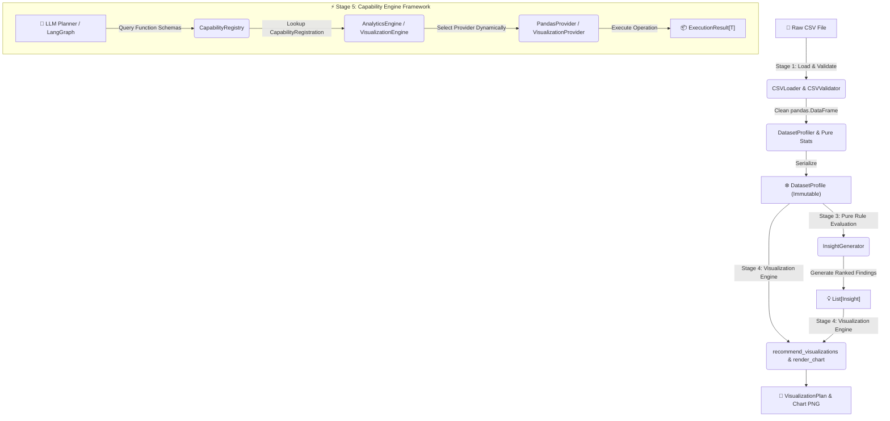

<div align="center">

# 📊 CSV Analytics Agent

**A production-grade, evidence-driven tabular analytics framework built with Python 3.10+, Pydantic v2, and a deterministic layered pipeline & execution engine architecture.**

[](https://www.python.org/)
[](https://github.com/Vishaldave45/CSV-Analytics-Agent/releases/tag/v0.5.0)
[](https://github.com/Vishaldave45/CSV-Analytics-Agent)
[](https://github.com/astral-sh/ruff)
[](https://github.com/python/mypy)
[](LICENSE)

</div>

---

## 🌟 Overview

The **CSV Analytics Agent** converts raw tabular data (`.csv` files) into structured, evidence-backed insights, renderer-independent visualizations, and executable analytical capabilities. Designed around **Domain-Driven Design (DDD)** principles, the agent processes datasets through a strict, multi-stage pipeline where statistics, business rules, visualization recommendations, and capability execution engines operate deterministically before being exposed to agentic LLM planners or LangGraph workflows.

> [!IMPORTANT]
> **Deterministic First, LLM Second**: Statistics, insights, visualization rules, and capability execution are evaluated deterministically using immutable Pydantic v2 models and provider abstractions. This eliminates hallucinated data summaries and guarantees 100% explainability and safety.

---

## ✨ Key Capabilities

| Feature | Description |
| :--- | :--- |
| 🛡️ **Robust Data Loader** | Validates structural integrity, missing files, non-empty bounds, and automatically detects encodings (`utf-8`, `latin-1`, `cp1252`, `iso-8859-1`). |
| 📊 **Pure Dataset Profiler** | Computes missing value ratios, row duplicates, memory distribution, and column-level statistical profiles without side effects. |
| 🔍 **Evidence Engine** | Pure business rules evaluate immutable dataset profiles to generate structured findings (`Insight`) backed by empirical facts (`Evidence`). |
| 🎨 **Visualization Recommendation** | Pure rule engine maps dataset statistical profiles to optimal, renderer-independent chart specifications (`HISTOGRAM`, `BAR`, `LINE`, `SCATTER`, `BOXPLOT`, `PIE`, `HEATMAP`) and Matplotlib rendering. |
| ⚡ **Execution Engine Framework** | Decouples high-level domain capabilities (`AnalyticsEngine`, `VisualizationEngine`) from underlying libraries (`PandasProvider`) registered inside a central `CapabilityRegistry`. |
| 🤖 **LLM Tool Schema Export** | `CapabilityRegistry` automatically exports function-calling JSON schemas for OpenAI, Anthropic, and Gemini LLM function-calling planners. |
| 🧪 **Comprehensive Test Suite** | Every module, validation guard, statistical evaluator, provider, engine, and exception path is tested with full statement coverage. |

---

## 🏗️ Architecture & Pipeline Flow

The framework follows a decoupled 5-tier architecture:



### Layer Responsibilities

```text
                           ┌────────────────────────┐
                           │      Raw CSV File      │
                           └───────────┬────────────┘
                                       │
                                       ▼
 ┌───────────────────────────────────────────────────────────────────────────┐
 │ Stage 1 — Data Ingestion & Validation Layer                               │
 │ (Handles encoding auto-detection, schema checks, structural balance)     │
 └─────────────────────────────┬─────────────────────────────────────────────┘
                               │
                               ▼
 ┌───────────────────────────────────────────────────────────────────────────┐
 │ Stage 2 — Dataset Profiling & Statistical Engine                          │
 │ (Row/Col summary, Missing values, Memory distribution, Column profiles)  │
 └─────────────────────────────┬─────────────────────────────────────────────┘
                               │
                               ▼
 ┌───────────────────────────────────────────────────────────────────────────┐
 │ Stage 3 — Insights Engine & Structured Evidence Generation                │
 │ (Evaluates missing, duplicates, cardinality; emits Insight & Evidence)    │
 └─────────────────────────────┬─────────────────────────────────────────────┘
                               │
                               ▼
 ┌───────────────────────────────────────────────────────────────────────────┐
 │ Stage 4 — Visualization Recommendation & Rendering Engine                 │
 │ (Maps statistical metadata to ChartSpecification & renders Matplotlib PNG)│
 └─────────────────────────────┬─────────────────────────────────────────────┘
                               │
                               ▼
 ┌───────────────────────────────────────────────────────────────────────────┐
 │ Stage 5 — Capability Engine Framework (`execution/`)                     │
 │ (CapabilityRegistry ──> Domain Engines ──> Providers ──> Libraries)       │
 └───────────────────────────────────────────────────────────────────────────┘
```

---

## ⚡ Quickstart

### Installation

Clone the repository and set up your virtual environment using `uv` (recommended) or `pip`:

```bash
# Clone the repository
git clone https://github.com/Vishaldave45/CSV-Analytics-Agent.git
cd CSV-Analytics-Agent

# Sync dependencies with uv (creates .venv automatically)
uv sync

# Or using standard pip in editable mode
pip install -e ".[dev]"
```

### Python API Example

```python
from pathlib import Path
from csv_analytics_agent.data import CSVLoader
from csv_analytics_agent.profiler import DatasetProfiler
from csv_analytics_agent.insights import InsightGenerator
from csv_analytics_agent.visualization import recommend_visualizations, render_chart
from csv_analytics_agent.execution import (
    CapabilityRegistry,
    AnalyticsEngine,
    VisualizationEngine,
    ExecutionRequest,
)

# 1. Load and validate CSV file safely
file_path = Path("data/sample_dataset.csv")
loader = CSVLoader(file_path=file_path)
df = loader.load()

# 2. Compute pure dataset profile & statistics
profiler = DatasetProfiler()
profile = profiler.profile(df)

# 3. Generate evidence-backed insights
generator = InsightGenerator()
insights = generator.generate(profile)

# 4. Recommend visualization plan
viz_plan = recommend_visualizations(profile, insights=insights)
print(f"Primary Chart: {viz_plan.primary.chart_type.value} - {viz_plan.primary.title}")

# 5. Execute capability via Execution Engine Framework
registry = CapabilityRegistry()
analytics_engine = AnalyticsEngine()
viz_engine = VisualizationEngine()

# Register engine capabilities
for desc in analytics_engine.list_capabilities():
    registry.register(desc, analytics_engine)

for desc in viz_engine.list_capabilities():
    registry.register(desc, viz_engine)

# Execute an aggregation request
req = ExecutionRequest(
    capability_name="aggregate",
    target_columns=["salary"],
    parameters={"operation": "mean"},
)
engine = registry.get_engine("aggregate")
result = engine.execute_capability(req, df)

print(f"Status: {result.status.value}")
print(f"Result: {result.message} -> {result.data}")
```

---

## 🧩 Domain Models & Exceptions

### Domain Models (`execution/models.py`, `visualization/models.py`, `insights/models.py`, `profiler/models.py`)

| Model | Immutability | Description |
| :--- | :---: | :--- |
| `CapabilityDescriptor` | `frozen=True` | Metadata defining a capability name, description, JSON schema, and default provider. |
| `ExecutionRequest` | `frozen=True` | Payload requesting capability execution with column targets and parameters. |
| `ExecutionResult[T]` | `frozen=True` | Type-safe generic result wrapper with status, message, payload data `T`, and timing. |
| `CapabilityRegistration` | `frozen=True` | Registration metadata container linking a capability descriptor to its rank priority. |
| `DatasetProfile` | `frozen=True` | Complete statistical breakdown of tabular dataset. |
| `ChartSpecification` | `frozen=True` | Renderer-independent chart definition (type, title, axes, description). |
| `VisualizationPlan` | `frozen=True` | Recommendation container holding primary and alternative chart specifications. |
| `Insight` | `frozen=True` | Explainable finding containing title, category, severity score, and `Evidence`. |

### Domain Exception Hierarchy (`exceptions/data_errors.py` & `execution/exceptions.py`)

```text
CSVAnalyticsError (Base Domain Exception)
├── CSVLoaderError
│   ├── CSVEncodingError
│   ├── CSVParsingError
│   └── EmptyCSVError
└── ExecutionError
    ├── ProviderError
    ├── CapabilityNotFoundError
    └── EngineValidationError
```

---

## 🛠️ Project Structure

```text
csv-analytics-agent/
├── src/csv_analytics_agent/
│   ├── config/             # Environment settings & configuration management
│   ├── data/               # Stage 1: Data loader, encoding detector & CSV validator
│   ├── profiler/           # Stage 2: Dataset profiler & pure column statistics
│   ├── insights/           # Stage 3: Deterministic rules, generator & evidence
│   ├── visualization/      # Stage 4: Chart recommendations & Matplotlib renderer
│   ├── execution/          # Stage 5: Execution Engine Framework
│   │   ├── models.py       # Domain models (CapabilityDescriptor, ExecutionRequest, ExecutionResult)
│   │   ├── base.py         # Abstract base classes (BaseProvider, BaseEngine)
│   │   ├── exceptions.py   # Execution exception hierarchy
│   │   ├── registry.py     # CapabilityRegistry & LLM tool schema exporter
│   │   ├── providers/      # Execution providers
│   │   │   └── pandas.py   # PandasProvider encapsulating pandas operations
│   │   └── domain/         # Domain engines
│   │       ├── analytics.py     # AnalyticsEngine (aggregate, filter, group, sort, top_n)
│   │       └── visualization.py # VisualizationEngine adapter wrapping Stage 4
│   └── exceptions/         # Base exceptions
├── tests/                  # Complete unit test suite (121 tests)
│   ├── config/
│   ├── data/
│   ├── exceptions/
│   ├── execution/
│   ├── insights/
│   ├── profiler/
│   └── visualization/
├── pyproject.toml          # Project metadata, dependencies & tool settings
├── mypy.ini                # Strict MyPy configuration
├── ruff.toml              # Ruff linter & formatter rules
└── README.md               # Root documentation
```

---

## 🧪 Quality Assurance & Testing

The project maintains strict quality controls:

```bash
# Code linting & style enforcement with Ruff
uv run ruff check .

# Code formatting check
uv run ruff format --check .

# Strict static type checking with MyPy
uv run mypy src

# Run pytest suite
uv run pytest
```

### Current Verification Metrics

- **Unit Tests**: `121 passed` in `0.68s`
- **Type Safety**: `0 errors` (Strict MyPy mode across 39 source files)
- **Formatting**: 100% compliant with Ruff standards

---

## 🗺️ Product Roadmap

- [x] **Stage 1 — Data Loader & Validator** (`v0.1.0`)
  - Auto-encoding detection, file checks, structural validation.
- [x] **Stage 2 — Dataset Profiler & Pure Statistics** (`v0.2.0`)
  - Summary metrics, missing/duplicate analytics, column-level profiles.
- [x] **Stage 3 — Deterministic Insights Engine & Evidence** (`v0.3.0`)
  - Pure rule evaluation (`MissingDataRule`, `DuplicateRowsRule`, `HighCardinalityRule`), severity ranking.
- [x] **Stage 4 — Visualization Recommendation & Rendering Engine** (`v0.4.0`)
  - Automatic chart mapping and Matplotlib rendering engine.
- [x] **Stage 5 — Execution Engine Framework** (`v0.5.0`)
  - Decoupled `CapabilityRegistry`, `AnalyticsEngine`, `VisualizationEngine`, `PandasProvider`.
- [ ] **Stage 6 — Schema Vector Indexing & Semantic Search** (`v0.6.0`)
  - Semantic column search with vector embeddings.
- [ ] **Stage 7 — LangChain / LlamaIndex Tool Integrations** (`v0.7.0`)
  - Reusable agent tool adapters for LLM frameworks.
- [ ] **Stage 8 — Gemini Tool Calling & Agentic Planner** (`v0.8.0`)
  - Intent recognition and multi-step query decomposition.
- [ ] **Stage 9 — LangGraph Stateful Workflows** (`v0.9.0`)
  - Cyclic stateful workflows and multi-agent collaboration.
- [ ] **Stage 10 — Interactive UI & Session Memory** (`v1.0.0`)
  - Web dashboard with persistent session history.

---

## 🤝 Contributing

Contributions are welcome! Please follow these guidelines:
1. Ensure all new logic is backed by comprehensive unit tests.
2. Run `uv run ruff check .`, `uv run ruff format --check .`, `uv run mypy src`, and `uv run pytest` before submitting pull requests.
3. Keep code strictly typed, immutable, and co-located in domain modules.

---

## 📄 License

This project is licensed under the [MIT License](LICENSE).