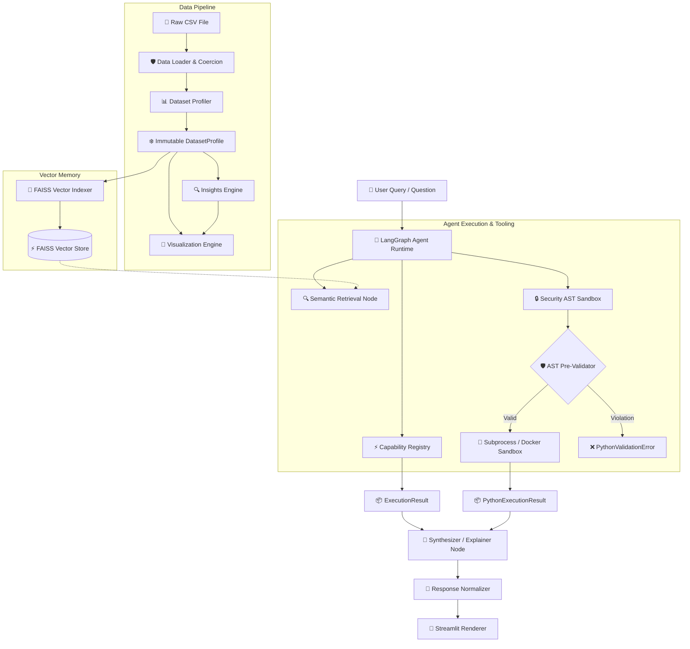

# 🤖 CSV Analytics Agent

> An agentic tabular data analytics engine that allows users to upload CSV datasets, ask questions in natural language, and receive data-driven explanations, interactive visualizations, DataFrames, and downloadable analytical results.

[](https://www.python.org/)
[](https://streamlit.io/)
[](https://pandas.pydata.org/)
[](https://ai.google.dev/)
[](https://www.langchain.com/langgraph)
[](https://github.com/facebookresearch/faiss)
[](https://github.com/Vishaldave45/CSV-Analytics-Agent)
[](LICENSE)

---

## 📸 Demo

The **CSV Analytics Agent** provides a modern conversational workspace for exploring uploaded CSV datasets through natural language queries.

<p align="center">
  
</p>

### Key Interaction Screens

| Feature Screen | Image Placeholder | Description |
| :--- | :--- | :--- |
| **Dataset Upload & Profiling** | `` | Upload CSV datasets with auto-encoding detection, coercing numeric/date fields, and rendering dataset DNA profiles. |
| **Natural Language Reasoning** | `` | Explains complex analytical questions in Markdown while separating textual answers from data artifacts. |
| **Interactive Visual Analytics** | `` | Generates interactive Plotly and Matplotlib charts (Histograms, Bar Charts, Scatter Plots, Heatmaps). |
| **DataFrame & CSV Export** | `` | Displays bounded DataFrame tables with interactive sorting and CSV export options. |

> [!NOTE]
> Add screenshot files to `docs/images/` to embed live visual assets directly inside GitHub.

---

## 📌 Overview

The **CSV Analytics Agent** is an end-to-end tabular data intelligence platform built upon **Clean Architecture** and **Domain-Driven Design (DDD)** principles.

The platform enforces a strict architectural rule:

> [!IMPORTANT]
> **Deterministic First, LLM Second**: All statistical calculations, dataset profiling, rule evaluations, and chart specifications are calculated **deterministically** using pure Python, Pandas, and immutable Pydantic v2 models. The LLM (Gemini via LangChain/LangGraph) serves purely as an intent router, query planner, and narrative synthesizer. This design completely eliminates mathematical hallucinations.

---

## 🎯 Problem Statement

Traditional tabular data analysis requires users to manually load files, calculate missingness ratios, write complex Pandas transformation scripts, write visualization code, and interpret mathematical outputs.

The **CSV Analytics Agent** provides a conversational workflow:

```text
User Question
     ↓
Agent Planning & Schema Retrieval
     ↓
Deterministic Computation / AST Sandbox
     ↓
Plotly / Matplotlib Visualization
     ↓
Natural-Language Explanation & Response Normalization
```

---

## ✨ Key Features

- 📂 **Robust CSV Upload & Preprocessing**: Auto-detects encodings (`utf-8`, `latin-1`, `cp1252`), parses currency strings (`$1,099`), percentages (`64%`), and dates.
- 📊 **Dataset Statistical DNA**: Computes summary statistics (row/col count, missingness ratios, cardinality, quantiles) without side effects.
- 🔍 **Proactive Evidence Engine**: Business rules evaluate dataset profiles to synthesize ranked findings (`Insight`) paired with empirical data facts (`Evidence`).
- 💬 **Natural Language Agent**: LangGraph state machine orchestrating query routing, semantic schema retrieval, planning, tool calls, and explanation synthesis.
- 🧠 **FAISS Vector Schema Memory**: Local vector store (`SentenceTransformers`) indexing dataset column schemas for semantic retrieval during planning.
- 🔒 **Multi-Layer Python Execution Sandbox**: AST-validated Python code executor supporting isolated subprocesses (`SubprocessBackend`) or Docker containers (`DockerBackend`).
- 📈 **Interactive Visual Analytics**: Renderer-agnostic chart recommender generating interactive Plotly charts and high-res Matplotlib PNGs.
- 📋 **DataFrame & Artifact Protocol**: Structured `AgentResponse` encapsulating plain Markdown text narrative, interactive tables, charts, metrics, and download buttons.
- 🔄 **AI Response Normalizer**: Bridge service (`_clean_text_content` with `ast.literal_eval`) stripping LLM metadata (`extras`, `signature`) into clean Markdown text.
- 🧪 **Automated Testing Suite**: 475+ unit, integration, and normalization tests covering core domain components.

---

## ⚙️ How It Works



---

## 🧠 AI / Agent Architecture

### Separation of Responsibilities

| Component | Technology | Responsibility |
| :--- | :--- | :--- |
| **LLM Orchestrator** | Google Gemini (`ChatGoogleGenerativeAI`) | Natural language intent routing, query planning, tool selection, and narrative synthesis. |
| **Agent Workflow** | LangGraph `StateGraph` | Stateful execution graph, iteration control, memory retrieval nodes, and state checkpointing. |
| **Vector Memory** | FAISS + `SentenceTransformers` | Indexes column schemas and metadata for semantic schema retrieval during planning. |
| **Deterministic Engine** | Pandas & NumPy | Executes numerical calculations, aggregations, groupings, and statistics. |
| **Security Sandbox** | AST Inspector + Docker / Subprocess | Safely executes LLM-generated Python analysis code in isolated boundaries. |
| **Response Normalizer** | `result_normalizer.py` | Parses raw LLM block representations into plain Markdown, stripping internal metadata. |
| **Presentation Layer** | Streamlit | Multi-page conversational UI rendering text, interactive charts, and DataFrames. |

---

## 🧩 Prompting Strategy

The agent uses structured prompt templates (`prompts/`) for analytical reasoning:

1. **System Prompt (`prompts/agent/system.md`)**: Configures agent identity, analytical domain rules, tool selection criteria, and safety constraints.
2. **Planning Prompt**: Directs the LLM to select appropriate capabilities (`AnalyticsEngine`, `VisualizationEngine`) or Python code execution.
3. **Response Synthesis Prompt (`prompts/response/system.md`)**: Enforces text-first narrative explanations grounded in verified Pandas computation outputs.

---

## 🔄 Response Normalization

When modern LLMs (such as Google Gemini via `langchain-google-genai`) return content block structures, the raw representation contains internal metadata:

```python
[
    {
        "type": "text",
        "text": "The dataset contains 1,465 product records across 16 columns...",
        "extras": {
            "signature": "EI4K..."
        }
    }
]
```

Without normalization, stringifying this object directly renders Python dictionary quotes in the UI.

### Implemented Normalization Pipeline:
```text
Raw AIMessage / Content Blocks
              ↓
  _clean_text_content() [json.loads & ast.literal_eval fallback]
              ↓
  Strip internal metadata ('extras', 'signature', 'tool_call_id')
              ↓
  Clean Markdown Answer String
              ↓
  Canonical AgentResponse Contract
              ↓
  st.markdown() UI Rendering
```

For full normalization architecture details, inspect [docs/response-normalization.md](docs/response-normalization.md).

---

## 📊 Visualization & Analytical Artifacts

The system separates narrative explanations from structured analytical artifacts:

| Analysis Task | Generated Artifact | Interactive Features |
| :--- | :--- | :--- |
| **Distribution Analysis** | Histogram Chart | Plotly hover tooltips, bin adjustments |
| **Group Comparison** | Bar Chart | Interactive legend toggles, sorting |
| **Correlation Analysis** | Scatter Plot / Heatmap | Trendlines, zoom, pan, hover metadata |
| **Outlier Detection** | Box Plot | Spread inspection, outlier identification |
| **Filtered Data View** | Bounded DataFrame Table | Interactive sorting, column search, CSV export |
| **KPI Metrics** | Scalar Metric Card | Formatted numeric values with thousands separators |

---

## 💬 Example Questions

| Category | Example Question | Target Engine |
| :--- | :--- | :--- |
| **Summary** | *"Give me a summary of this dataset."* | `DatasetProfiler` |
| **Aggregation** | *"What is the average rating across all products?"* | `AnalyticsEngine.aggregate` |
| **Ranking** | *"Which are the top 10 products by review count?"* | `AnalyticsEngine.top_n` |
| **Distribution** | *"Show me the distribution of product ratings."* | `VisualizationEngine` (Histogram) |
| **Filtering** | *"Find products with discounts exceeding 50%."* | `AnalyticsEngine.filter` |
| **Comparison** | *"Which product category has the highest average rating?"* | `AnalyticsEngine.groupby` + Bar Chart |
| **Relationship** | *"Is price correlated with customer ratings?"* | `VisualizationEngine` (Scatter Plot) |

---

## 🛠️ Technology Stack

| Layer | Technology | Purpose |
| :--- | :--- | :--- |
| **Language** | Python 3.10+ | Core application and strict type checking |
| **UI Framework** | Streamlit | Multi-page conversational analytics workspace |
| **Data Processing** | Pandas & NumPy | Tabular data parsing, coercion, and computation |
| **LLM Provider** | Google Gemini (`ChatGoogleGenerativeAI`) | Natural language intent routing and explanation synthesis |
| **Agent Framework** | LangChain & LangGraph | Stateful agentic workflow, router, and tool execution loops |
| **Vector Store** | FAISS (`faiss-cpu`) | Column schema semantic search index |
| **Visualization** | Plotly & Matplotlib | High-resolution interactive charts and static PNGs |
| **Sandboxing** | Subprocess / Docker (`DockerBackend`) | AST-validated isolated Python code execution |
| **Testing** | pytest, Ruff, MyPy | Automated test suite (475 passed), linting, and type checking |

---

## 📁 Project Directory Structure

```text
csv-analytics-agent/
├── src/csv_analytics_agent/
│   ├── config/             # Pydantic Settings & environment configuration
│   ├── exceptions/         # Base exception hierarchy
│   ├── llm/                # LangChain LLM abstraction & Gemini integration
│   ├── preprocessing/      # CSV loading, encoding detection & coercion
│   ├── profiler/           # Column statistical DNA & profiling
│   ├── insights/           # Proactive business rules & evidence engine
│   ├── visualization/      # Chart recommendation & Plotly/Matplotlib renderers
│   ├── execution/          # CapabilityRegistry, AnalyticsEngine, PandasProvider
│   ├── persistence/        # SQLite metadata storage & SHA256 hashing
│   ├── memory/             # FAISS vector store & column semantic search
│   ├── observability/      # LangSmith callback handlers & tracing setup
│   ├── services/           # Result normalizer & API gateway converters
│   ├── graph/              # LangGraph StateGraph & AgentRuntime engine
│   └── python_engine/      # AST pre-validator, subprocess & Docker sandbox
├── streamlit_app/          # Streamlit Multi-Page Web Application
│   ├── app.py              # Application entrypoint
│   ├── components/         # Reusable UI components
│   ├── pages/              # Overview, Dataset, Insights, Chat, Settings
│   └── services/           # Backend service bridge
├── sandbox/                # Docker sandbox container build context
├── docs/                   # Architecture, normalization & interview documentation
│   ├── architecture.md
│   ├── response-normalization.md
│   └── interview-guide.md
├── tests/                  # Complete unit, integration, and evaluation suite (475 passed)
├── .env.example            # Environment variable template
├── pyproject.toml          # Project configuration (uv / hatchling)
└── README.md               # Master GitHub README
```

---

## 🚀 Installation & Quickstart

### 1. Prerequisites
- **Python**: 3.10 or higher
- **Package Manager**: [`uv`](https://github.com/astral-sh/uv) (recommended) or `pip`
- **Docker** (optional, required only for containerized sandbox execution)

### 2. Clone & Install Dependencies

```bash
# Clone the repository
git clone https://github.com/Vishaldave45/CSV-Analytics-Agent.git
cd CSV-Analytics-Agent

# Install dependencies using uv (creates .venv automatically)
uv sync

# Or using standard pip
pip install -e ".[dev]"
```

### 3. Environment Configuration

Copy `.env.example` to `.env` and add your API key:

```bash
cp .env.example .env
```

Edit `.env`:
```ini
# Application & Gemini LLM Settings
GOOGLE_API_KEY=AIzaSy_your_key_here

# Python Execution Engine Sandbox Configuration
PYTHON_EXECUTION_BACKEND=subprocess  # Options: 'subprocess' or 'container'
PYTHON_SANDBOX_IMAGE=csv-analytics-python:latest
PYTHON_SANDBOX_MEMORY_MB=512
PYTHON_SANDBOX_CPU_LIMIT=1.0
PYTHON_SANDBOX_TIMEOUT_SECONDS=30

# LangSmith Tracing (Optional)
LANGCHAIN_TRACING_V2=false
LANGCHAIN_API_KEY=your_langsmith_key_here
```

### 4. Build Docker Sandbox Image (Optional)

```bash
docker build -t csv-analytics-python:latest ./sandbox
```

### 5. Launch Application

```bash
uv run streamlit run streamlit_app/app.py
```

Open browser at `http://localhost:8501`.

---

## 🧪 Testing

The repository maintains strict quality controls with 475 passing unit and integration tests:

```bash
# 1. Run Ruff Linter & Format Check
uv run ruff check src/ tests/
uv run ruff format --check src/ tests/

# 2. Run MyPy Static Type Checker (Strict Mode)
uv run mypy src/

# 3. Run Pytest Suite
uv run pytest -m "not llm" --cov=csv_analytics_agent --cov-report=term-missing
```

---

## 📚 Deep Technical Documentation

Comprehensive documentation is available in the `/docs` directory:

| Document | Description |
| :--- | :--- |
| **[docs/architecture.md](docs/architecture.md)** | End-to-end query execution pipeline, state machine nodes, and execution engine contracts. |
| **[docs/response-normalization.md](docs/response-normalization.md)** | Text extraction cleaner (`_clean_text_content`), content block parsing, and `AgentResponse` contract. |
| **[docs/interview-guide.md](docs/interview-guide.md)** | 30s/1m/3m technical project explanation, architectural design decisions, and system trade-offs. |

---

## ⚠️ Limitations

- **Memory Constraints**: Processes datasets in-memory using Pandas; optimal performance for CSVs up to 1GB.
- **File Formats**: Designed specifically for tabular `.csv` datasets.
- **Sandbox Caps**: Dynamic code execution is restricted to 30 seconds and 512MB RAM memory limits.

---

## 🗺️ Future Roadmap

- [ ] **Multi-Format Ingestion**: Support for Parquet, Excel (`.xlsx`), and JSON datasets.
- [ ] **Database Connectors**: Direct querying for PostgreSQL, Snowflake, and BigQuery databases.
- [ ] **MicroVM Isolation**: Integration with gVisor / Firecracker microVM execution sandboxes.
- [ ] **Multi-Table Analytics**: Multi-file relational joins and schema mapping.

---

## 🤝 Contributing

Contributions are welcome! Please follow these steps:

1. Fork the repository.
2. Create a feature branch (`git checkout -b feature/amazing-feature`).
3. Ensure formatting and type checks pass (`uv run ruff check src/ tests/` & `uv run mypy src/`).
4. Run unit tests (`uv run pytest`).
5. Open a Pull Request.

---

## 📄 License

This project is licensed under the **MIT License**. See the [LICENSE](LICENSE) file for details.