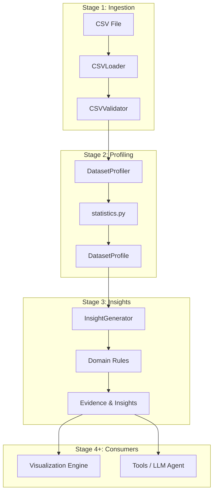

# 📚 Documentation Hub Index

Welcome to the **CSV Analytics Agent** documentation repository. This directory contains architectural decisions, software requirement specifications (SRS), domain standards, and pipeline design guidelines for the framework.

---

## 🏛️ Architectural Decision Records (ADRs)

We maintain Architectural Decision Records (ADRs) to document key structural choices, domain boundaries, and design trade-offs.

| Record ID | Title | Status | Primary Focus Area |
| :--- | :--- | :---: | :--- |
| 📐 **[ADR-001](adr/ADR-001-project-architecture.md)** | [Layered Pipeline Architecture](adr/ADR-001-project-architecture.md) | `ACCEPTED` | Decoupled 4-stage ingestion, profiling, rules engine & LLM workflow. |
| 🔒 **[ADR-002](adr/ADR-002-immutable-models.md)** | [Immutable Data Models](adr/ADR-002-immutable-models.md) | `ACCEPTED` | Pydantic v2 `frozen=True` models (`DatasetProfile`, `Insight`, `Evidence`). |
| 🧮 **[ADR-003](adr/ADR-003-pure-statistics-functions.md)** | [Pure Statistical Functions](adr/ADR-003-pure-statistics-functions.md) | `ACCEPTED` | Stateless mathematical metric calculation in `profiler/statistics.py`. |
| 🔍 **[ADR-004](adr/ADR-004-evidence-based-insights.md)** | [Evidence-Based Insights](adr/ADR-004-evidence-based-insights.md) | `ACCEPTED` | Structured `Evidence` facts backing explainable `Insight` findings. |
| 🛡️ **[ADR-005](adr/ADR-005-loader-responsibility.md)** | [CSV Loader Boundaries](adr/ADR-005-loader-responsibility.md) | `ACCEPTED` | Strict separation of file validation/ingestion from data coercion. |

---

## 🎯 Domain Requirements Specification

- **Software Requirement Specification**: [`SRS_CSV_Analytics_Agent.docx`](SRS_CSV_Analytics_Agent.docx) — Formal specification detailing functional and non-functional requirements, data quality thresholds, and validation rules.

---

## 🏗️ Architecture Design Principles

### Core Design Rules
1. **Single Responsibility**: `CSVLoader` handles reading and encodings; `DatasetProfiler` computes metrics; `InsightGenerator` evaluates business rules.
2. **Immutability & Safety**: All domain state is stored in frozen Pydantic models. Once generated, a `DatasetProfile` or `Insight` cannot be mutated.
3. **Determinism**: Every rule evaluation returns identical output for identical inputs without relying on external state or LLM stochasticity.
4. **100% Explainability**: Every `Insight` carries an explicit dictionary of empirical facts (`Evidence`).

---

## 🚀 Navigation & Links

- 👈 **[Return to Main README](../README.md)**
- 💻 **[Source Architecture Guide](../src/csv_analytics_agent/README.md)**
