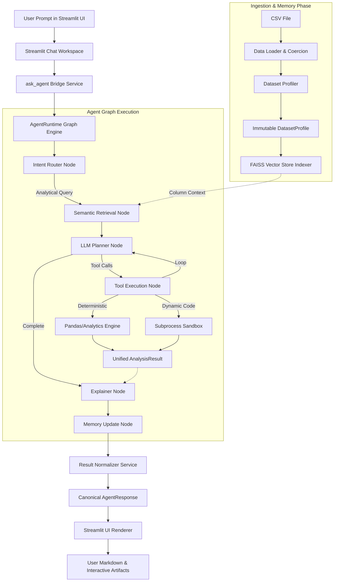

# Technical Architecture & System Documentation

## Executive Overview
The **CSV Analytics Agent** is an enterprise-grade tabular data analytics engine that accepts raw CSV datasets and answers natural language analytical queries. Built using **Python 3.10+**, **Pydantic v2**, **LangChain**, **LangGraph**, **FAISS Vector Memory**, and **Streamlit**, the platform enforces a strict architectural principle:

> **Deterministic First, LLM Second**: All statistical computations, data profiling, rule evaluations, and chart generation are performed **deterministically** using pure Python, Pandas, and immutable Pydantic v2 domain models. The LLM (Gemini 2.5/3.6 via LangChain/LangGraph) operates strictly as an intent router, planner, and narrative synthesizer. This architecture guarantees 100% explainable, reproducible analytical results without numerical hallucinations.

---

## Architecture & End-to-End Execution Pipeline

---

## Detailed Component Responsibilities

### 1. Data Ingestion & Coercion (`src/csv_analytics_agent/preprocessing/`)
- **Loader**: Automatically detects file encoding (`utf-8`, `latin-1`, `cp1252`, `iso-8859-1`) and loads raw bytes into a pandas DataFrame.
- **Coercion**: Coerces numeric strings, currency symbols (`$`, `₹`), percentages (`%`), commas, and date formats into explicit numerical and datetime dtypes.
- **Hashing**: Generates a SHA-256 hash string for dataset versioning and resource caching.

### 2. Dataset Profiling (`src/csv_analytics_agent/profiler/`)
- Computes complete column statistical DNA (row count, column count, memory usage, missing value percentages, unique cardinalities, min/max/mean/std, quantiles, and top frequency values).
- Generates an immutable `DatasetProfile` model used for tool binding, schema grounding, and visualization recommendations.

### 3. Capability Execution & Security Sandbox (`src/csv_analytics_agent/execution/` & `python_engine/`)
- **Deterministic Capability Registry**: Encapsulates standard analytical operations (`describe`, `aggregate`, `filter`, `group`, `sort`, `top_n`, `render_visualization`) behind the `PandasProvider` and `VisualizationEngine`.
- **Python Security Sandbox**: Dynamic open-ended calculations execute inside a subprocess sandbox (`SubprocessBackend`) or Docker container (`DockerBackend`). Includes an AST static code analyzer (`policy.py`) that blocks dangerous imports (`os`, `sys`, `subprocess`), reflection, and file/network access.

### 4. LangGraph Stateful Runtime (`src/csv_analytics_agent/graph/`)
- Stateful workflow managing interaction nodes: `router` $\rightarrow$ `retrieval` $\rightarrow$ `planner` $\leftrightarrow$ `tool` $\rightarrow$ `explainer` $\rightarrow$ `memory_update`.
- Maintains session thread history, active dataset filters, iteration bounds, and execution state checkpoints.

### 5. Response Normalization Layer (`src/csv_analytics_agent/services/result_normalizer.py`)
- **Text Block Extraction (`_clean_text_content`)**: Parses raw LLM block representations (e.g. `[{"type": "text", "text": "..."}]`) and Python single-quote repr strings (`ast.literal_eval`), extracting pure Markdown text while discarding internal metadata (`extras`, `signature`, `tool_call_id`).
- **Multi-Artifact Encapsulation**: Normalizes output payloads into the canonical `AgentResponse` containing `answer: str` and `artifacts: list[AnalysisArtifact]`.

### 6. Streamlit AI Workspace Presentation (`streamlit_app/`)
- Renders assistant messages in order:
  1. Plain Markdown text narrative (`st.markdown`)
  2. Bulleted Key Insights
  3. Interactive Visualizations (Plotly / Matplotlib PNGs)
  4. Interactive DataFrames (bounded preview with CSV export)
  5. Expandable Calculation & Trust Evidence Drawer
