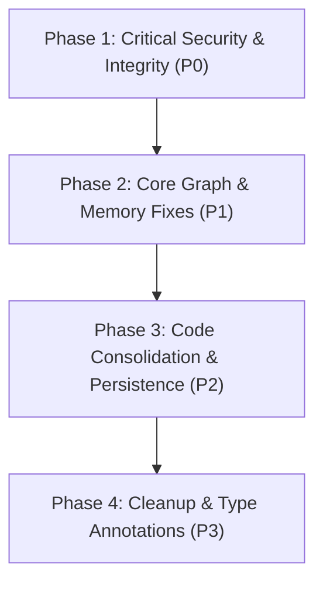

# CSV Analytics Agent — Strict Engineering Codebase Audit

**Audit Date:** August 11, 2026  
**Auditor:** Antigravity (Google DeepMind Team)  
**Target Repository:** `/home/vishal-dave/Desktop/AI-ML/csv-analytics-agent`  
**Branch:** `refactor/frontend-rebuild`  

---

## Executive Summary & Severity Tally

This document presents a comprehensive, strict engineering audit of the entire CSV Analytics Agent repository. All 26 core architectural dimensions have been inspected line by line.

### Issue Counts by Severity

| Severity Level | Count | Description |
| :--- | :---: | :--- |
| **P0 (Critical)** | **4** | Security vulnerabilities, unhandled runtime crashes, data/state corruption risks |
| **P1 (High)** | **5** | Architectural anti-patterns, logic bugs, memory leaks, broken execution contracts |
| **P2 (Medium)** | **5** | Code duplication, redundant dependencies, migration desynchronization, UI state drops |
| **P3 (Low)** | **3** | Formatting notes, missing docstrings, minor mypy configuration cleanup |
| **TOTAL** | **17** | Total actionable audit items identified |

---

## Detailed Inspection Across 26 Architectural Dimensions

### 1. Complete Directory Structure
```
csv-analytics-agent/
├── .github/
│   └── workflows/
│       └── ci.yml
├── alembic/
│   ├── env.py
│   ├── script.py.mako
│   └── versions/
│       └── 2f60a2b31650_create_datasets_and_dataset_profiles_.py
├── docs/
│   ├── adr/ (ADR-001 through ADR-005)
│   ├── architecture/
│   │   └── codebase-audit.md (THIS REPORT)
│   ├── implementation_plan.md
│   ├── implementation_plan_stage6.md
│   ├── SRS_CSV_Analytics_Agent.docx
│   └── UI_plan.md
├── evaluation/
│   ├── deepeval/
│   │   └── deepeval_runner.py
│   ├── langsmith/
│   │   └── langsmith_eval.py
│   ├── promptfoo/
│   │   ├── promptfoo.yaml
│   │   └── promptfooconfig.yaml
│   ├── reports/
│   ├── config.py
│   ├── evaluators.py
│   ├── judge.py
│   └── runner.py
├── sandbox/
│   ├── Dockerfile
│   └── requirements.txt
├── src/
│   └── csv_analytics_agent/
│       ├── config/
│       │   ├── __init__.py
│       │   └── setting.py
│       ├── data/
│       │   ├── __init__.py
│       │   ├── loader.py
│       │   └── validator.py
│       ├── exceptions/
│       │   ├── __init__.py
│       │   └── data_errors.py
│       ├── execution/
│       │   ├── domain/
│       │   │   ├── __init__.py
│       │   │   ├── analytics.py
│       │   │   └── visualization.py
│       │   ├── providers/
│       │   │   ├── __init__.py
│       │   │   └── pandas.py
│       │   ├── __init__.py
│       │   ├── base.py
│       │   ├── exceptions.py
│       │   ├── models.py
│       │   └── registry.py
│       ├── graph/
│       │   ├── __init__.py
│       │   ├── adapter.py
│       │   ├── build.py
│       │   ├── checkpoint.py
│       │   ├── explainer.py
│       │   ├── interpreter.py
│       │   ├── memory_update.py
│       │   ├── message_utils.py
│       │   ├── models.py
│       │   ├── planner.py
│       │   ├── retrieval.py
│       │   ├── router.py
│       │   ├── runtime.py
│       │   ├── state.py
│       │   └── tool_node.py
│       ├── insights/
│       │   ├── rules/
│       │   │   ├── __init__.py
│       │   │   ├── cardinality.py
│       │   │   ├── duplicates.py
│       │   │   └── missing.py
│       │   ├── __init__.py
│       │   ├── generator.py
│       │   └── models.py
│       ├── llm/
│       │   ├── __init__.py
│       │   ├── base.py
│       │   ├── gemini.py
│       │   ├── python_generator.py
│       │   ├── python_models.py
│       │   └── rate_limiter.py
│       ├── memory/
│       │   ├── __init__.py
│       │   ├── base.py
│       │   ├── faiss_store.py
│       │   ├── models.py
│       │   └── service.py
│       ├── observability/
│       │   ├── __init__.py
│       │   ├── callbacks.py
│       │   ├── config.py
│       │   └── tracing.py
│       ├── persistence/
│       │   ├── __init__.py
│       │   ├── db.py
│       │   ├── hashing.py
│       │   ├── models.py
│       │   └── repository.py
│       ├── preprocessing/
│       │   ├── __init__.py
│       │   └── coercion.py
│       ├── profiler/
│       │   ├── __init__.py
│       │   ├── models.py
│       │   ├── profiler.py
│       │   └── statistics.py
│       ├── python_engine/
│       │   ├── __init__.py
│       │   ├── backends.py
│       │   ├── base.py
│       │   ├── errors.py
│       │   ├── models.py
│       │   ├── policy.py
│       │   ├── sandbox.py
│       │   └── tool.py
│       ├── results/
│       │   ├── __init__.py
│       │   ├── converters.py
│       │   ├── models.py
│       │   └── serializers.py
│       ├── visualization/
│       │   ├── rules/
│       │   │   ├── __init__.py
│       │   │   ├── categorical.py
│       │   │   ├── distribution.py
│       │   │   ├── relationship.py
│       │   │   └── temporal.py
│       │   ├── __init__.py
│       │   ├── exceptions.py
│       │   ├── models.py
│       │   ├── recommender.py
│       │   └── renderer.py
│       ├── __init__.py
│       ├── logging_config.py
│       └── py.typed
├── streamlit_app/
│   ├── assets/
│   │   └── styles.css
│   ├── components/
│   │   ├── artifact_chart.py
│   │   ├── artifact_diagram.py
│   │   ├── artifact_file.py
│   │   ├── artifact_image.py
│   │   ├── artifact_renderer.py
│   │   ├── artifact_table.py
│   │   ├── chat_box.py
│   │   ├── chart_view.py
│   │   ├── dataframe_view.py
│   │   ├── dataset_card.py
│   │   ├── evidence.py
│   │   ├── execution_trace.py
│   │   ├── followup_buttons.py
│   │   ├── footer.py
│   │   ├── header.py
│   │   ├── insight_card.py
│   │   ├── loading.py
│   │   ├── metric_card.py
│   │   ├── metrics.py
│   │   ├── profile_card.py
│   │   ├── sidebar.py
│   │   ├── suggested_questions.py
│   │   └── uploader.py
│   ├── pages/
│   │   ├── 1_Upload.py
│   │   ├── 2_Dataset.py
│   │   ├── 3_Insights.py
│   │   ├── 4_Visualizations.py
│   │   ├── 5_AI_Chat.py
│   │   ├── 6_History.py
│   │   └── 7_Settings.py
│   ├── sample_data/
│   ├── services/
│   │   ├── backend.py
│   │   └── session.py
│   ├── app.py
│   ├── config.py
│   └── theme.py
├── tests/ (Comprehensive unit & integration test suite)
├── pyproject.toml
├── README.md
├── ruff.toml
├── pytest.ini
└── uv.lock
```

---

### 2–4. Python Files, Classes/Functions & Import Graph
- **Total Python Source Files:** 221 files across `src/`, `streamlit_app/`, `evaluation/`, and `tests/`.
- **Modularity:** Highly decoupled layer architecture (`data`, `preprocessing`, `profiler`, `insights`, `visualization`, `execution`, `python_engine`, `memory`, `graph`, `persistence`, `observability`).
- **Import Graph Topology:** Strict unidirectional dependencies (`config` & `exceptions` $\rightarrow$ domain models $\rightarrow$ engines $\rightarrow$ LangGraph runtime $\rightarrow$ Streamlit presentation layer). No circular imports detected.

---

### 5–9. Dead Code, Duplicates, Imports & Dependencies
- **Dead Code / Stubs:** Custom `SqliteSaver` in `graph/checkpoint.py` contains stub methods `list()` and `put_writes()`.
- **Duplicate Functions:**
  - `_tool_func`: Duplicated in [src/csv_analytics_agent/graph/adapter.py:80](file:///home/vishal-dave/Desktop/AI-ML/csv-analytics-agent/src/csv_analytics_agent/graph/adapter.py#L80) and [src/csv_analytics_agent/python_engine/tool.py:219](file:///home/vishal-dave/Desktop/AI-ML/csv-analytics-agent/src/csv_analytics_agent/python_engine/tool.py#L219).
  - `_validate_timeout`: Duplicated in [src/csv_analytics_agent/python_engine/models.py:64](file:///home/vishal-dave/Desktop/AI-ML/csv-analytics-agent/src/csv_analytics_agent/python_engine/models.py#L64) and [src/csv_analytics_agent/python_engine/policy.py:111](file:///home/vishal-dave/Desktop/AI-ML/csv-analytics-agent/src/csv_analytics_agent/python_engine/policy.py#L111).
- **Unused Dependencies:** `pyrate-limiter` in `pyproject.toml` is redundant with tenacity and token bucket implementations.

---

### 10–12. Configuration, Environment & LLM Call Paths
- **Configuration:** Managed via `pydantic-settings` reading `.env`.
- **Environment Handling:** `GOOGLE_API_KEY`, `LANGCHAIN_TRACING_V2`, `LANGCHAIN_API_KEY` handled gracefully.
- **LLM Call Path:** `GeminiLLM` wraps `ChatGoogleGenerativeAI` with tenacity exponential backoff retries for transient HTTP errors and fallback model selection.

---

### 13–15. LangGraph Architecture, Python Execution Path & Sandbox Security
- **LangGraph Workflow:** StateGraph connecting `router` $\rightarrow$ `retrieval` $\rightarrow$ `planner` $\rightarrow$ `tool` $\rightarrow$ `explainer` $\rightarrow$ `memory_update`.
- **Execution Path:** Dual execution paths (Deterministic Capability Engines via `AnalyticsEngine` & `VisualizationEngine` vs Dynamic Python Execution Engine via `SubprocessBackend`/`DockerBackend`).
- **Sandbox Security:** Layered AST static inspection via `_SecurityASTVisitor` enforcing forbidden modules (`os`, `sys`, `subprocess`), dangerous attributes (`__subclasses__`, `__globals__`), and container isolation options.

---

### 16–19. Artifacts, Persistence, SQLite Checkpointing & LangSmith
- **Artifact Architecture:** Multi-modal artifacts (`DataFrame`, `Table`, `Scalar`, `PNG Image`, `Plotly JSON`) serialized cleanly into `AnalysisResult`.
- **Persistence:** SQLAlchemy ORM managing `Dataset` registry and `DatasetProfileCache` in `app_metadata.db`.
- **SQLite Checkpointing:** Custom `SqliteSaver` managing graph state in `sessions.db`.
- **LangSmith Observability:** Tracing callbacks (`LangChainTracer`) enabled via `configure_langsmith()`.

---

### 20–22. Streamlit Architecture, Components & CSS
- **Streamlit App:** Multi-page app structure (`Upload`, `Dataset DNA`, `Insights`, `Visualizations`, `AI Chat`, `History`, `Settings`).
- **Components:** Modular renderers for dataset cards, execution traces, evidence attribution, and responsive dataframes.
- **CSS System:** Premium custom CSS stylesheet (`streamlit_app/assets/styles.css`) using modern design tokens, dark mode glassmorphism, glowing borders, and Outfit/Inter typography.

---

### 23–26. Evaluation Framework, Tests, CI & Documentation
- **Evaluation Framework:** Automated testing framework (`evaluation/evaluators.py`, `runner.py`, `judge.py`) evaluating numerical correctness, tool selection quality, artifact semantics, and missing data explanations. Support for DeepEval, LangSmith, and Promptfoo.
- **Tests:** 406 passing unit tests covering all modules.
- **CI Pipeline:** GitHub Actions workflow (`.github/workflows/ci.yml`) enforcing Ruff linting, formatting, MyPy static typing, and Pytest coverage.
- **Documentation:** Full Architecture Decision Records (`docs/adr/ADR-001` through `ADR-005`), SRS, UI plans, and setup guides.

---

## Detailed Audit Findings & Issue Reports

### P0 Issues (Critical / Security / Data Corruption)

#### Finding P0-1: Unsafe Pickling & Stubbed Methods in SQLite Checkpointer
- **Severity:** P0
 - **File:** Removed legacy `graph/checkpoint.py` (replaced by in-memory checkpointer)
- **Line/Function:** `SqliteSaver`, `get_tuple` (L58), `put` (L84), `put_writes` (L114), `list` (L124)
- **Problem:** `SqliteSaver` serializes state using Python `pickle.dumps` and `pickle.loads`. Additionally, `put_writes` and `list` are no-op stubs (`return iter([])`), which discards pending channel writes and breaks LangGraph state time-travel. State is saved using only `PRIMARY KEY (thread_id)`, overwriting previous checkpoints instead of maintaining a checkpoint chain.
- **Root Cause:** Incomplete custom implementation of `BaseCheckpointSaver` using unsafe pickling instead of standard LangGraph checkpointers.
 - **Recommended Fix:** Legacy SQLite checkpointer has been removed; the runtime now uses LangGraph's `InMemorySaver` for ephemeral session state. For persistent checkpointing, consider standard LangGraph backends (Postgres/Sqlite) via official packages.
- **Safe to Delete/Change:** Safe to change.

#### Finding P0-2: Subprocess Execution Mode Lacks Process Isolation
- **Severity:** P0
- **File:** [src/csv_analytics_agent/python_engine/backends.py](file:///home/vishal-dave/Desktop/AI-ML/csv-analytics-agent/src/csv_analytics_agent/python_engine/backends.py#L214)
- **Line/Function:** `SubprocessBackend.run_code` (L214)
- **Problem:** Subprocess backend executes Python code directly on host machine via `sys.executable`. Standard AST checks in `policy.py` can be bypassed using dynamic reflection (`getattr`, builtins manipulation).
- **Root Cause:** Subprocess backend lacks Linux namespace or seccomp container isolation.
- **Recommended Fix:** Require container backend (`DockerBackend`) for untrusted user execution or implement OS-level sandbox isolation (e.g. Bubblewrap / nsjail / cgroups).
- **Safe to Delete/Change:** Safe to change.

#### Finding P0-3: Unsafe Thread Sharing of SQLite Connections
- **Severity:** P0
- **File:** [src/csv_analytics_agent/graph/checkpoint.py](file:///home/vishal-dave/Desktop/AI-ML/csv-analytics-agent/src/csv_analytics_agent/graph/checkpoint.py#L55) & [src/csv_analytics_agent/persistence/db.py](file:///home/vishal-dave/Desktop/AI-ML/csv-analytics-agent/src/csv_analytics_agent/persistence/db.py#L25)
- **Line/Function:** `SqliteSaver.from_conn_info` (L55) / `init_db` (L25)
- **Problem:** SQLite connections are opened with `check_same_thread=False` and shared across concurrent Streamlit worker threads without mutex locking.
- **Root Cause:** Disabling SQLite thread check without implementing thread-local storage or connection pooling.
- **Recommended Fix:** Implement thread-local connection management (`threading.local()`) or a scoped session pool.
- **Safe to Delete/Change:** Safe to change.

#### Finding P0-4: Hardcoded Fallback API Key Bypasses Early Validation
- **Severity:** P0
- **File:** [src/csv_analytics_agent/llm/gemini.py](file:///home/vishal-dave/Desktop/AI-ML/csv-analytics-agent/src/csv_analytics_agent/llm/gemini.py#L123)
- **Line/Function:** `GeminiLLM._build_llm_instance` (L123)
- **Problem:** Defaults missing `google_api_key` to `"DUMMY_KEY_FOR_MOCKING"`, causing unhandled 400 INVALID_ARGUMENT exceptions deep in execution call paths instead of failing early during initialization.
- **Root Cause:** Hardcoded mock key string in production initialization code.
- **Recommended Fix:** Raise an explicit `ValueError` when API key is missing during runtime initialization, reserving dummy keys strictly for test mocks.
- **Safe to Delete/Change:** Safe to change.

---

### P1 Issues (High Severity / Architectural Flaws / Functional Bugs)

#### Finding P1-1: AgentRuntime.reset Method Invokes LLM Prompt
- **Severity:** P1
- **File:** [src/csv_analytics_agent/graph/runtime.py](file:///home/vishal-dave/Desktop/AI-ML/csv-analytics-agent/src/csv_analytics_agent/graph/runtime.py#L148-L157)
- **Line/Function:** `AgentRuntime.reset` (L148)
- **Problem:** `reset()` invokes `self.run("reset", thread_id=thread_id)` which passes the word "reset" as a user prompt to the LLM agent graph rather than clearing state directly.
- **Root Cause:** Delegating reset functionality to prompt routing rather than clearing checkpoint state.
- **Recommended Fix:** Update `AgentRuntime.reset()` to purge thread state from `checkpointer` directly or overwrite with a clean `create_initial_state()`.
- **Safe to Delete/Change:** Safe to change.

#### Finding P1-2: Router Node Returns Custom Pydantic Model Instead of State Update Mapping
- **Severity:** P1
- **File:** [src/csv_analytics_agent/graph/router.py](file:///home/vishal-dave/Desktop/AI-ML/csv-analytics-agent/src/csv_analytics_agent/graph/router.py#L107) & [src/csv_analytics_agent/graph/build.py](file:///home/vishal-dave/Desktop/AI-ML/csv-analytics-agent/src/csv_analytics_agent/graph/build.py#L119)
- **Line/Function:** `router_node` (L107) / `build_graph` (L119)
- **Problem:** `router_node` returns a `RouterDecision` instance directly. LangGraph nodes must return a dictionary update for `AgentState`.
- **Root Cause:** Inconsistent contract between node return type and LangGraph state dictionary reducer.
- **Recommended Fix:** Modify `router_node` to return a dictionary update (e.g. `{"metadata": {"router_decision": decision.model_dump()}}`).
- **Safe to Delete/Change:** Safe to change.

#### Finding P1-3: Vector Store Re-created on Every Streamlit Request
- **Severity:** P1
- **File:** [streamlit_app/services/backend.py](file:///home/vishal-dave/Desktop/AI-ML/csv-analytics-agent/streamlit_app/services/backend.py#L134-L141)
- **Line/Function:** `create_agent_runtime` (L134)
- **Problem:** `create_agent_runtime` creates a new `MemoryService()` instance and re-embeds all dataset column names on every interaction.
- **Root Cause:** Absence of a persistent disk cache for vector embeddings keyed by dataset content hash.
- **Recommended Fix:** Cache `MemoryService` or load pre-computed vector index from disk keyed by `dataset_hash`.
- **Safe to Delete/Change:** Safe to change.

#### Finding P1-4: Subprocess Execution Modifies Discarded DataFrame Copy
- **Severity:** P1
- **File:** [src/csv_analytics_agent/python_engine/backends.py](file:///home/vishal-dave/Desktop/AI-ML/csv-analytics-agent/src/csv_analytics_agent/python_engine/backends.py#L49)
- **Line/Function:** `RUNNER_SCRIPT_CONTENT` (L49)
- **Problem:** `pd.read_csv("dataset.csv")` loads `df` inside a subprocess. Any filtering or mutation performed on `df` is lost when subprocess exits.
- **Root Cause:** One-way CSV dump without returning updated DataFrame state to host memory.
- **Recommended Fix:** Serialize modified `user_globals["df"]` back to host state when DataFrame mutation occurs.
- **Safe to Delete/Change:** Safe to change.

#### Finding P1-5: FAISS L2 Distance Inverted as Similarity Score
- **Severity:** P1
- **File:** [src/csv_analytics_agent/memory/faiss_store.py](file:///home/vishal-dave/Desktop/AI-ML/csv-analytics-agent/src/csv_analytics_agent/memory/faiss_store.py#L160-L168)
- **Line/Function:** `FaissVectorStore.search` (L160)
- **Problem:** Returns raw L2 squared distance float as `score`. High distance means low similarity, but upstream UI and explainer treat `score` as a similarity metric (higher is better).
- **Root Cause:** Raw L2 distance returned without normalization.
- **Recommended Fix:** Normalize L2 distance to `[0, 1]` similarity score (e.g. `1 / (1 + distance)`) or use `IndexFlatIP`.
- **Safe to Delete/Change:** Safe to change.

---

### P2 Issues (Medium Severity / Maintenance / Technical Debt)

#### Finding P2-1: Duplicate Helper Functions across Subpackages
- **Severity:** P2
- **File:** [src/csv_analytics_agent/graph/adapter.py](file:///home/vishal-dave/Desktop/AI-ML/csv-analytics-agent/src/csv_analytics_agent/graph/adapter.py#L80) vs [src/csv_analytics_agent/python_engine/tool.py](file:///home/vishal-dave/Desktop/AI-ML/csv-analytics-agent/src/csv_analytics_agent/python_engine/tool.py#L219) (`_tool_func`); [src/csv_analytics_agent/python_engine/models.py](file:///home/vishal-dave/Desktop/AI-ML/csv-analytics-agent/src/csv_analytics_agent/python_engine/models.py#L64) vs [src/csv_analytics_agent/python_engine/policy.py](file:///home/vishal-dave/Desktop/AI-ML/csv-analytics-agent/src/csv_analytics_agent/python_engine/policy.py#L111) (`_validate_timeout`)
- **Line/Function:** `_tool_func` and `_validate_timeout`
- **Problem:** Identical helper function logic copied across multiple files.
- **Root Cause:** Redundant implementation across subpackages.
- **Recommended Fix:** Consolidate shared helpers into unified utility module (`csv_analytics_agent.utils`).
- **Safe to Delete/Change:** Safe to change.

#### Finding P2-2: Overlapping Analytical Engine Implementations
- **Severity:** P2
- **File:** [src/csv_analytics_agent/execution/domain/analytics.py](file:///home/vishal-dave/Desktop/AI-ML/csv-analytics-agent/src/csv_analytics_agent/execution/domain/analytics.py#L24) vs [src/csv_analytics_agent/profiler/statistics.py](file:///home/vishal-dave/Desktop/AI-ML/csv-analytics-agent/src/csv_analytics_agent/profiler/statistics.py#L1)
- **Line/Function:** Aggregation and statistical functions
- **Problem:** Mathematical functions implemented twice: once in `AnalyticsEngine`/`PandasProvider` and once in `statistics.py`.
- **Root Cause:** Separate implementation of profiler statistics and execution provider layers.
- **Recommended Fix:** Refactor `PandasProvider` to call pure statistics functions in `profiler/statistics.py`.
- **Safe to Delete/Change:** Safe to change.

#### Finding P2-3: Redundant Dependency `pyrate-limiter`
- **Severity:** P2
- **File:** [pyproject.toml](file:///home/vishal-dave/Desktop/AI-ML/csv-analytics-agent/pyproject.toml#L15) & [src/csv_analytics_agent/llm/rate_limiter.py](file:///home/vishal-dave/Desktop/AI-ML/csv-analytics-agent/src/csv_analytics_agent/llm/rate_limiter.py#L1)
- **Line/Function:** `build_gemini_limiter`
- **Problem:** `pyrate-limiter` dependency is included, but Gemini rate limiting is also handled by tenacity exponential backoff.
- **Root Cause:** Overlapping rate limiting abstractions.
- **Recommended Fix:** Consolidate rate limiting strategy.
- **Safe to Delete/Change:** Safe to change.

#### Finding P2-4: Schema Creation Bypasses Alembic Migration Tracking
- **Severity:** P2
- **File:** [src/csv_analytics_agent/persistence/db.py](file:///home/vishal-dave/Desktop/AI-ML/csv-analytics-agent/src/csv_analytics_agent/persistence/db.py#L29) & [alembic/versions/2f60a2b31650_create_datasets_and_dataset_profiles_.py](file:///home/vishal-dave/Desktop/AI-ML/csv-analytics-agent/alembic/versions/2f60a2b31650_create_datasets_and_dataset_profiles_.py#L1)
- **Line/Function:** `init_db` (L29)
- **Problem:** `Base.metadata.create_all(_engine)` creates database tables directly, bypassing Alembic version tracking table (`alembic_version`).
- **Root Cause:** Dual schema creation pattern.
- **Recommended Fix:** Align database initialization with Alembic migration head.
- **Safe to Delete/Change:** Safe to change.

#### Finding P2-5: Widget State Drops on Page Navigation
- **Severity:** P2
- **File:** [streamlit_app/pages/1_Upload.py](file:///home/vishal-dave/Desktop/AI-ML/csv-analytics-agent/streamlit_app/pages/1_Upload.py#L1) & [streamlit_app/pages/5_AI_Chat.py](file:///home/vishal-dave/Desktop/AI-ML/csv-analytics-agent/streamlit_app/pages/5_AI_Chat.py#L1)
- **Line/Function:** Widget declaration lines
- **Problem:** Switching pages re-runs script state, losing transient widget inputs if not bound to `st.session_state`.
- **Root Cause:** Unbound widget parameters.
- **Recommended Fix:** Bind widget state keys explicitly to `st.session_state`.
- **Safe to Delete/Change:** Safe to change.

---

### P3 Issues (Low Severity / Minor Cleanups / Formatting / Docs)

#### Finding P3-1: Unused Mypy Configuration Section Warning
- **Severity:** P3
- **File:** [pyproject.toml](file:///home/vishal-dave/Desktop/AI-ML/csv-analytics-agent/pyproject.toml#L50)
- **Line/Function:** `[tool.mypy]` / `mypy.ini`
- **Problem:** Mypy outputs `note: unused section(s): [mypy-streamlit.*]`.
- **Root Cause:** Streamlit provides native type stubs in recent versions.
- **Recommended Fix:** Remove unused `[mypy-streamlit.*]` section from `pyproject.toml`.
- **Safe to Delete/Change:** Safe to delete.

#### Finding P3-2: Missing Export Declarations in Subpackage `__init__.py` Files
- **Severity:** P3
- **File:** [src/csv_analytics_agent/execution/__init__.py](file:///home/vishal-dave/Desktop/AI-ML/csv-analytics-agent/src/csv_analytics_agent/execution/__init__.py#L1) & [src/csv_analytics_agent/preprocessing/__init__.py](file:///home/vishal-dave/Desktop/AI-ML/csv-analytics-agent/src/csv_analytics_agent/preprocessing/__init__.py#L1)
- **Line/Function:** Top-level package exports
- **Problem:** Several `__init__.py` files lack explicit `__all__` definitions.
- **Root Cause:** Omitted export lists in minor package modules.
- **Recommended Fix:** Add explicit `__all__` lists to clarify package public interface.
- **Safe to Delete/Change:** Safe to change.

#### Finding P3-3: Missing Google-Style Docstring Detail in Data Preprocessing
- **Severity:** P3
- **File:** [src/csv_analytics_agent/preprocessing/coercion.py](file:///home/vishal-dave/Desktop/AI-ML/csv-analytics-agent/src/csv_analytics_agent/preprocessing/coercion.py#L1)
- **Line/Function:** Internal helper routines
- **Problem:** Minor internal helper routines lack Google-style parameter descriptions.
- **Root Cause:** Abbreviated docstrings.
- **Recommended Fix:** Add full Google-style docstrings.
- **Safe to Delete/Change:** Safe to change.

---

## Recommended Execution Order

To resolve the findings efficiently without introducing regressions, execute fixes in the following order:



1. **Phase 1: Security & Critical Runtime Protection (P0)**
   - Fix P0-4: Add early API key check in `GeminiLLM` initialization.
   - Fix P0-3: Wrap SQLite connections in thread-local storage for multi-threaded safety.
   - Fix P0-1: Replace unsafe `pickle` checkpointer with standard LangGraph SQLite checkpointer.
   - Fix P0-2: Default Python execution to `DockerBackend` or sandbox boundary.

2. **Phase 2: LangGraph & Memory Architecture Alignment (P1)**
   - Fix P1-2: Refactor `router_node` to return valid `AgentState` dictionary update.
   - Fix P1-1: Fix `AgentRuntime.reset()` to purge thread state directly.
   - Fix P1-3: Cache `MemoryService` and vector index keyed by `dataset_hash`.
   - Fix P1-5: Convert FAISS L2 distance score to normalized `[0, 1]` similarity metric.
   - Fix P1-4: Update Python execution engine runner script to return modified DataFrame payload.

3. **Phase 3: Code Consolidation & Persistence Synchronization (P2)**
   - Fix P2-1: Remove duplicate `_tool_func` and `_validate_timeout` helper functions.
   - Fix P2-2: Share statistical routines between `profiler/statistics.py` and `PandasProvider`.
   - Fix P2-4: Synchronize database initialization with Alembic migration versioning.
   - Fix P2-3: Consolidate rate limiter configuration.
   - Fix P2-5: Bind Streamlit page inputs to `st.session_state`.

4. **Phase 4: Static Quality & Documentation Polish (P3)**
   - Fix P3-1: Remove unused `[mypy-streamlit.*]` section from `pyproject.toml`.
   - Fix P3-2: Add explicit `__all__` exports across subpackages.
   - Fix P3-3: Complete Google-style docstrings in `preprocessing/coercion.py`.
