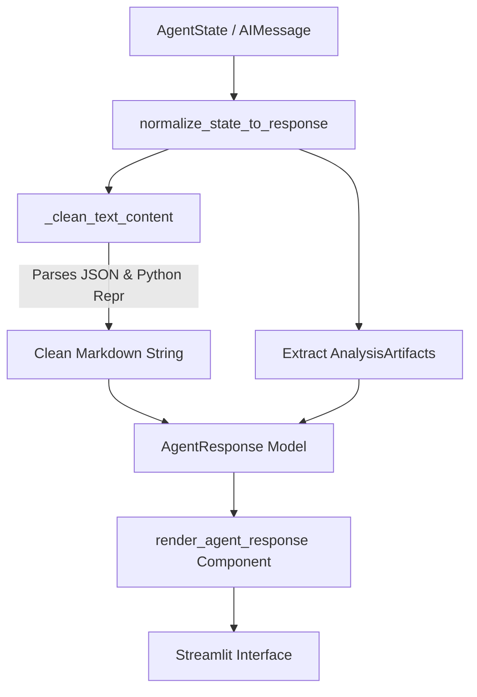

# Response Normalization & Pipeline Architecture

## The Problem Solved

When modern LLMs (such as Google Gemini via `langchain-google-genai`) return responses containing metadata, or when structured message content arrays are used, `AIMessage.content` is returned as a list of dictionaries or stringified Python representations containing content blocks:

```python
[
    {
        "type": "text",
        "text": "The dataset contains 1,465 product records across 16 columns...",
        "extras": {"signature": "EI4K..."},
    }
]
```

Without a normalization layer, converting `AIMessage.content` directly to a string using `str()` produces literal Python representations on the user screen: `[{'type': 'text', 'text': '...', 'extras': {'signature': '...'}}]`.

---

## Implemented Normalization Pipeline

The CSV Analytics Agent implements a dedicated normalization bridge between the internal agent graph state and the Streamlit UI presentation layer.



### Core Components

#### 1. Text Cleaner (`_clean_text_content`)
Located in `src/csv_analytics_agent/services/result_normalizer.py`:
- Detects stringified JSON arrays (`[...]`) and dicts (`{...}`).
- Uses `json.loads` and `ast.literal_eval` as a fallback for Python single-quoted repr strings.
- Recursively traverses nested lists and dicts, extracting values associated with `"type": "text"` or `"text"`.
- Strips out internal metadata keys (`extras`, `signature`, `tool_call_id`, `run_id`).

#### 2. Canonical Response Contract (`AgentResponse`)
Located in `src/csv_analytics_agent/models/response.py`:
```python
class AgentResponse(BaseModel):
    type: AgentResponseType
    answer: str  # Always guaranteed to be a plain Markdown string
    table: AnalysisArtifact | None
    visualization: AnalysisArtifact | None
    artifacts: list[AnalysisArtifact]
    insights: list[str]
    calculation: str | None
    error: str | None
    suggestions: list[str]
    metadata: dict[str, Any]
```

#### 3. Streamlit UI Dispatcher (`render_agent_response`)
Located in `streamlit_app/components/agent_response.py`:
- Receives only `AgentResponse`.
- Passes `response.answer` directly to `st.markdown()`.
- Renders artifacts (`table`, `visualization`, `artifacts`) through `render_artifact()`.
- Exposes metadata inside an expandable "How this was calculated" drawer.
